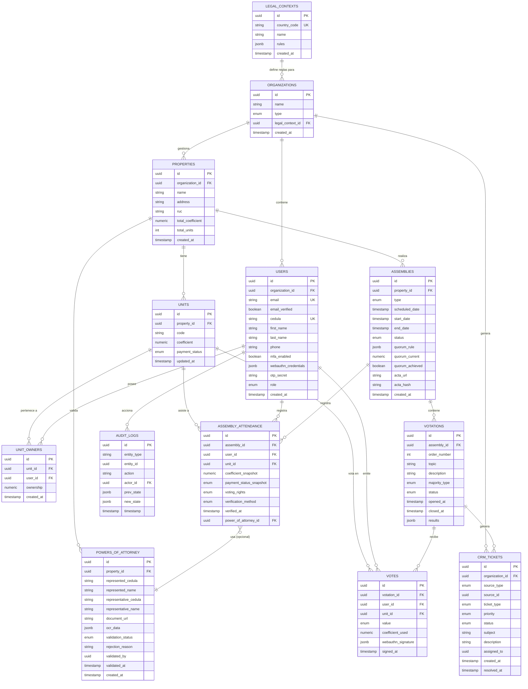

# 📊 DIAGRAMAS - Assembly 2.0
**Todos los diagramas visuales del proyecto consolidados**

---

## 🗂️ DIAGRAMA ENTIDAD-RELACIÓN (ERD)

### Modelo de Datos Completo



---

## 📐 ESTRUCTURA MULTI-TENANT

```
┌─────────────────────────────────────────────────────────────┐
│                     LEGAL CONTEXTS                           │
│  (country_code, rules)                                       │
└──────────────────────────┬──────────────────────────────────┘
                           │
                           ▼
┌─────────────────────────────────────────────────────────────┐
│                    ORGANIZATIONS                             │
│  (Promotoras / PHs Independientes)                          │
│  ┌─────────────────────────────────────────────────┐        │
│  │ RLS: organization_id                            │        │
│  └─────────────────────────────────────────────────┘        │
└────┬───────────────────────────┬──────────────────┬─────────┘
     │                           │                  │
     ▼                           ▼                  ▼
┌─────────────┐         ┌─────────────┐    ┌──────────────┐
│ PROPERTIES  │         │   USERS     │    │ CRM_TICKETS  │
│ (PHs)       │         │             │    │              │
└──────┬──────┘         └──────┬──────┘    └──────────────┘
       │                       │
       ├───────────────────────┤
       │                       │
       ▼                       ▼
┌─────────────┐         ┌──────────────┐
│   UNITS     │◄────────┤ UNIT_OWNERS  │
│             │         │              │
└──────┬──────┘         └──────────────┘
       │
       │
       ▼
┌─────────────────────────────────────────────┐
│          ASSEMBLIES                         │
│  (Asambleas Ordinarias/Extraordinarias)     │
└──────┬──────────────────────────────────────┘
       │
       ├──────────────────┬─────────────────┐
       │                  │                 │
       ▼                  ▼                 ▼
┌──────────────┐   ┌─────────────┐  ┌──────────────────┐
│ ATTENDANCE   │   │ VOTATIONS   │  │ POWERS_ATTORNEY  │
│              │   │             │  │                  │
└──────┬───────┘   └──────┬──────┘  └──────────────────┘
       │                  │
       │                  ▼
       │           ┌─────────────┐
       └──────────►│   VOTES     │
                   │             │
                   └─────────────┘
```

---

## 🔄 FLUJO: Estado de Pago → Derecho a Voto

```
┌─────────────────────────────────────────────────────────────┐
│                    UNIT.payment_status                       │
│                    ┌──────────┬──────────┐                  │
│                    │  AL_DIA  │   MORA   │                  │
│                    └────┬─────┴─────┬────┘                  │
│                         │           │                        │
└─────────────────────────┼───────────┼────────────────────────┘
                          │           │
                          ▼           ▼
        ┌────────────────────────────────────────┐
        │  ASSEMBLY_ATTENDANCE (registro)        │
        │                                        │
        │  payment_status_snapshot (congelado)  │
        │  coefficient_snapshot (congelado)     │
        │                                        │
        │  ┌──────────────────────────────┐     │
        │  │  voting_rights se asigna:    │     │
        │  │  - AL_DIA  → VOTA           │     │
        │  │  - MORA    → SOLO_VOZ       │     │
        │  └──────────────────────────────┘     │
        └───────────────┬────────────────────────┘
                        │
                        ▼
        ┌────────────────────────────────────────┐
        │         VOTES (inserción)              │
        │                                        │
        │  ✅ TRIGGER: check_voting_rights()    │
        │                                        │
        │  IF voting_rights != 'VOTA':          │
        │     RAISE EXCEPTION                    │
        │                                        │
        └────────────────────────────────────────┘
```

---

## ⚡ FLUJO: Quórum en Tiempo Real

```
┌──────────────────────────────────────────────────────────┐
│         1. Admin marca asistencia (manual/Face ID)       │
└─────────────────────────┬────────────────────────────────┘
                          │
                          ▼
┌──────────────────────────────────────────────────────────┐
│  INSERT INTO assembly_attendance                         │
│  - coefficient_snapshot = unit.coefficient               │
│  - payment_status_snapshot = unit.payment_status         │
│  - voting_rights = (AL_DIA ? VOTA : SOLO_VOZ)           │
└─────────────────────────┬────────────────────────────────┘
                          │
                          ▼
┌──────────────────────────────────────────────────────────┐
│  ⚡ TRIGGER: update_quorum()                            │
│                                                          │
│  assemblies.quorum_current = SUM(coefficient_snapshot)  │
│    WHERE voting_rights = 'VOTA'                         │
│                                                          │
│  assemblies.quorum_achieved =                           │
│    quorum_current >= (required_pct * total_coefficient) │
└─────────────────────────┬────────────────────────────────┘
                          │
                          ▼
┌──────────────────────────────────────────────────────────┐
│  📡 SUPABASE REALTIME                                    │
│  → Emite cambios a tablero de presentación              │
│  → Alerta si quorum_achieved = false                    │
└──────────────────────────────────────────────────────────┘
```

---

## 🗳️ FLUJO: Votación Ponderada

```
┌──────────────────────────────────────────────────────────┐
│  1. Admin abre VOTATION (topic, majority_type)          │
└─────────────────────────┬────────────────────────────────┘
                          │
                          ▼
┌──────────────────────────────────────────────────────────┐
│  2. Propietarios emiten votos (SI/NO/ABSTENCION)        │
│                                                          │
│  INSERT INTO votes:                                      │
│  - value = SI/NO/ABSTENCION                             │
│  - coefficient_used = attendance.coefficient_snapshot   │
│  - webauthn_signature (firma biométrica)                │
│                                                          │
│  ✅ TRIGGER valida voting_rights = VOTA                │
└─────────────────────────┬────────────────────────────────┘
                          │
                          ▼
┌──────────────────────────────────────────────────────────┐
│  3. Cierre de votación (status = CLOSED)                │
│                                                          │
│  Cálculo de resultados:                                 │
│  - coef_si = SUM(coefficient_used WHERE value = SI)     │
│  - coef_no = SUM(coefficient_used WHERE value = NO)     │
│  - coef_abstencion = SUM(coefficient_used WHERE ...)    │
│                                                          │
│  Aprobación según majority_type:                        │
│  - SIMPLE: coef_si > coef_no                            │
│  - CALIFICADA: coef_si >= 66.67% presentes              │
│  - UNANIMIDAD: coef_si = 100%                           │
└─────────────────────────┬────────────────────────────────┘
                          │
                          ▼
┌──────────────────────────────────────────────────────────┐
│  ⚡ TRIGGER: create_crm_tickets_on_negative_votes()     │
│                                                          │
│  FOR cada voto = NO:                                     │
│    INSERT INTO crm_tickets (                            │
│      source_type = NEGATIVE_VOTE,                       │
│      ticket_type = SEGUIMIENTO_OBRA,                    │
│      subject = "Voto negativo en: [topic]"             │
│    )                                                     │
└──────────────────────────────────────────────────────────┘
```

---

## 🔐 FLUJO: Autenticación Yappy Style

```
┌──────────────────────────────────────────────────────────┐
│  PASO 1: Registro Inicial                               │
│                                                          │
│  1. Usuario ingresa EMAIL                               │
│  2. Sistema genera OTP (6 dígitos)                      │
│  3. Envío por servicio externo (Twilio/SendGrid)       │
│  4. Usuario valida OTP                                   │
│  5. users.email_verified = TRUE                         │
└─────────────────────────┬────────────────────────────────┘
                          │
                          ▼
┌──────────────────────────────────────────────────────────┐
│  PASO 2: Registro Biométrico (WebAuthn)                 │
│                                                          │
│  1. Servidor genera CHALLENGE                            │
│  2. Cliente invoca navigator.credentials.create()       │
│  3. Device genera keypair (Face ID/Touch ID)            │
│  4. Servidor valida y guarda:                           │
│     users.webauthn_credentials += {                     │
│       credential_id, public_key, device_name           │
│     }                                                    │
└─────────────────────────┬────────────────────────────────┘
                          │
                          ▼
┌──────────────────────────────────────────────────────────┐
│  PASO 3: Login y Firma de Votos                         │
│                                                          │
│  1. Cliente solicita challenge                           │
│  2. Servidor genera random challenge                     │
│  3. Cliente invoca navigator.credentials.get()          │
│  4. Device firma con private key                        │
│  5. Servidor valida con public_key guardada             │
│  6. Emite JWT/Session Token                             │
│                                                          │
│  Al votar:                                               │
│  - Se requiere nueva firma WebAuthn                     │
│  - Se guarda en votes.webauthn_signature               │
└──────────────────────────────────────────────────────────┘
```

---

## 🏢 FLUJO: Multi-Tenancy (RLS)

```
┌──────────────────────────────────────────────────────────┐
│           REQUEST con JWT/Session Token                  │
│           (contiene user_id)                             │
└─────────────────────────┬────────────────────────────────┘
                          │
                          ▼
┌──────────────────────────────────────────────────────────┐
│  Middleware: Extrae organization_id del user             │
│                                                          │
│  SET app.current_org_id = [organization_id]             │
└─────────────────────────┬────────────────────────────────┘
                          │
                          ▼
┌──────────────────────────────────────────────────────────┐
│  🔒 ROW LEVEL SECURITY (RLS)                            │
│                                                          │
│  POLICY: Todas las queries filtradas automáticamente:   │
│                                                          │
│  SELECT * FROM properties                               │
│  WHERE organization_id =                                │
│    current_setting('app.current_org_id')::UUID          │
│                                                          │
│  → Usuario solo ve datos de SU organización            │
└──────────────────────────────────────────────────────────┘
```

---

## 🎫 FLUJO: CRM Tickets

```
┌──────────────────────────────────────────────────────────┐
│           ORIGEN DEL TICKET                              │
│                                                          │
│  ┌───────────┐  ┌──────────────┐  ┌──────────────┐     │
│  │ Voto NO   │  │ Inquietud    │  │ Manual       │     │
│  │ (trigger) │  │ en Asamblea  │  │ (admin)      │     │
│  └─────┬─────┘  └──────┬───────┘  └──────┬───────┘     │
│        └────────────────┼──────────────────┘             │
└────────────────────────┼──────────────────────────────────┘
                         │
                         ▼
┌──────────────────────────────────────────────────────────┐
│  INSERT INTO crm_tickets:                                │
│  - organization_id (promotora responsable)              │
│  - source_type (NEGATIVE_VOTE, ASSEMBLY_CONCERN, ...)  │
│  - source_id (votation_id o assembly_id)                │
│  - ticket_type (MANTENIMIENTO, QUEJA, ...)              │
│  - priority (LOW, MEDIUM, HIGH, URGENT)                 │
│  - status (OPEN)                                         │
└─────────────────────────┬────────────────────────────────┘
                          │
                          ▼
┌──────────────────────────────────────────────────────────┐
│  Dashboard CRM para Promotora:                          │
│  - Lista de tickets pendientes                          │
│  - Asignación a responsables                            │
│  - Seguimiento y cierre                                 │
│  - Métricas: tiempo de resolución, satisfacción        │
└──────────────────────────────────────────────────────────┘
```

---

## 📄 FLUJO: Poderes Digitales con OCR

```
┌──────────────────────────────────────────────────────────┐
│  1. Propietario sube documento de poder (PDF/IMG)       │
└─────────────────────────┬────────────────────────────────┘
                          │
                          ▼
┌──────────────────────────────────────────────────────────┐
│  2. Storage: document_url guardada                       │
└─────────────────────────┬────────────────────────────────┘
                          │
                          ▼
┌──────────────────────────────────────────────────────────┐
│  3. OCR Service (AWS Textract / Google Vision):         │
│                                                          │
│  Extrae:                                                 │
│  - represented_cedula                                   │
│  - represented_name                                     │
│  - representative_cedula                                │
│  - representative_name                                  │
│  - fecha, firma (si detecta)                            │
│                                                          │
│  Guarda en powers_of_attorney.ocr_data (JSONB)         │
└─────────────────────────┬────────────────────────────────┘
                          │
                          ▼
┌──────────────────────────────────────────────────────────┐
│  4. Validación:                                          │
│                                                          │
│  ✅ Cédulas existen en sistema                          │
│  ✅ Representado es propietario de unidad               │
│  ✅ Poder corresponde a la asamblea vigente             │
│                                                          │
│  Status:                                                 │
│  - PENDING → Admin revisa manualmente si OCR dudoso     │
│  - APPROVED → Listo para usar en asamblea              │
│  - REJECTED → Motivo de rechazo                         │
└─────────────────────────┬────────────────────────────────┘
                          │
                          ▼
┌──────────────────────────────────────────────────────────┐
│  5. Uso en Asamblea:                                     │
│                                                          │
│  assembly_attendance.power_of_attorney_id = [poder_id]  │
│  → Representante vota en nombre del representado        │
│  → coefficient_snapshot = unidad representada           │
└──────────────────────────────────────────────────────────┘
```

---

## 🌍 ESCALABILIDAD INTERNACIONAL

```
┌──────────────────────────────────────────────────────────┐
│          LEGAL_CONTEXTS (Capa de Abstracción)           │
│                                                          │
│  ┌────────────┐  ┌────────────┐  ┌────────────┐        │
│  │ Panamá     │  │ México     │  │ Colombia   │        │
│  │ (Ley 284)  │  │ (Ley Cond.)│  │ (Ley 675)  │        │
│  │            │  │            │  │            │        │
│  │ Rules:     │  │ Rules:     │  │ Rules:     │        │
│  │ - quorum   │  │ - quorum   │  │ - quorum   │        │
│  │ - mora     │  │ - mora     │  │ - mora     │        │
│  │ - mayorías │  │ - mayorías │  │ - mayorías │        │
│  └────────────┘  └────────────┘  └────────────┘        │
└──────────────────────────────────────────────────────────┘
                          │
                          ▼
        Lógica de negocio consume rules dinámicamente
        → Sin refactorizar código al agregar país
```

---

## 📊 CONSTRAINTS DE INTEGRIDAD

| Constraint | Implementación | Objetivo |
|-----------|---------------|----------|
| Solo vota quien está AL_DIA | Trigger `check_voting_rights()` | Cumplir Ley 284 |
| Coeficiente congelado | Snapshot en `assembly_attendance` | Evitar manipulación |
| Quórum actualizado en tiempo real | Trigger `update_quorum()` | Transparencia |
| Suma de coeficientes = 100% | Validación en carga de unidades | Integridad matemática |
| Un voto por unidad | UNIQUE(votation_id, unit_id) | Evitar duplicados |
| Tickets automáticos por votos NO | Trigger en cierre de votación | CRM proactivo |
| Auditoría inmutable | Trigger `log_audit()` | Trazabilidad legal |
| Aislamiento multi-tenant | RLS por `organization_id` | Seguridad de datos |

---

**Fin de Diagramas**
