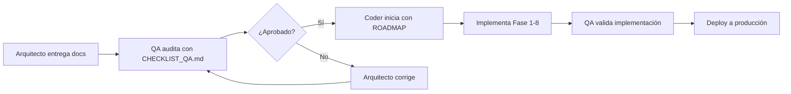

# 📚 Índice de Documentación - Assembly 2.0

**Arquitectura Técnica Completa**  
**Versión:** 1.4 (Docker + VPS ✅ DECISIÓN FINAL)  
**Última actualización:** 30 Enero 2026  
**Archivos totales:** 30 documentos principales  
**Status:** 🟢 ARQUITECTURA APROBADA - LISTO PARA DATABASE AGENT

---

## ⭐ DECISIÓN CRÍTICA DE INFRAESTRUCTURA (30 Enero 2026)

### **✅ APROBADO v2.0: VPS ALL-IN-ONE (Frontend + Backend + PostgreSQL + Chatbots)**

**CAMBIO IMPORTANTE:** Henry decidió tener TODO en un solo VPS (sin Supabase Cloud) debido a:
- Supabase Pro ($25/mes) es limitado (500 conexiones, 8GB storage)
- Supabase Team ($599/mes) es un salto de 24x en precio ❌
- **Mejor: Un solo pago, control total, sin límites**

**Documentos clave de la decisión:**
1. **[ARQUITECTURA_FINAL_DOCKER_VPS.md](Arquitecto/ARQUITECTURA_FINAL_DOCKER_VPS.md)** ⭐ ACTUALIZADO v2.0
   - VPS All-in-One: PostgreSQL + Next.js + Chatbots en un solo servidor
   - Docker local para desarrollo (igual setup que producción)
   - Hetzner CX51 ($32/mes) para producción
   - Auth self-hosted (Email + OTP + WebAuthn con Redis)
   - Realtime self-hosted (Socket.io + Redis Pub/Sub)
   - Backups con pg_dump automático

2. **[ANALISIS_SUPABASE_VS_VPS.md](Arquitecto/ANALISIS_SUPABASE_VS_VPS.md)** (v3.0)
   - Prueba real de Henry: Railway falló
   - VPS es confiable para chatbots always-on

3. **[ANALISIS_CLOUD_VS_VPS.md](Arquitecto/ANALISIS_CLOUD_VS_VPS.md)** (v2.0)
   - AWS/GCP/Azure vs VPS
   - Escenario real: 30 asambleas/mes, 500 concurrentes, $7k ingresos
   - VPS es 6x más barato

**Costos aprobados (ACTUALIZADO):**
```
Desarrollo: $20/mes (solo Cursor)
Producción: $32/mes (VPS CX51 + dominio)
Total Año 1: $537 (29% más barato que con Supabase)
```

**Próximo paso:** Database Agent debe revisar arquitectura, diseñar tablas de auth self-hosted, y validar schema para 500-1,000 concurrentes.

**Implicaciones técnicas:**
- ✅ Coder implementa Auth (Email + OTP con Redis, JWT para sesiones)
- ✅ Coder implementa Realtime (Socket.io + Redis Pub/Sub)
- ✅ Backups manuales con pg_dump (cron diario + S3 opcional)
- ✅ Más trabajo inicial, pero control total y sin límites

---

## ⭐ INICIO RÁPIDO

### **¿Quieres ver el progreso del proyecto?**

👉 **Lee `PROGRESO.md` primero** (5 min) 🎯

Este documento te muestra:
- ✅ Qué está listo
- 🔄 Qué está en progreso
- ⏸️ Qué está pendiente
- 📊 Métricas actualizadas
- 📅 Próximos pasos

**Actualizado diariamente por el Coder.**

---

## 🤖 EQUIPO DE AGENTES IA

### **👉 Lee `EQUIPO_AGENTES_CURSOR.md` primero** (20 min) 🎯

**Documento maestro que define:**
- ✅ 6 agentes especializados (Arquitecto, Contralor, Database, Coder, Marketing, QA)
- ✅ Modelo de IA óptimo para cada uno (Sonnet 4.5, Opus 4.5, GPT-5.2 Codex)
- ✅ Responsabilidades específicas de cada agente
- ✅ Tareas típicas y ejemplos prácticos
- ✅ Documentos que crea, consulta y NO toca
- ✅ Prompts completos para configurar en Cursor
- ✅ Matriz de coordinación (quién colabora con quién)
- ✅ Flujo de trabajo completo (ejemplo real)
- ✅ Matriz RACI (Responsible, Accountable, Consulted, Informed)
- ✅ Reglas de oro del equipo

**Beneficios:**
- 🚀 Especialización: Cada agente domina su área
- 🎯 No solapamiento: Responsabilidades claras
- ⚡ Eficiencia: Modelo IA óptimo por tarea
- 🔗 Coordinación: Flujo de trabajo definido

---

## 🏗️ ROL DEL ARQUITECTO

### **Responsabilidades Principales:**

1. ✅ Diseñar arquitectura técnica robusta y escalable
2. ✅ Garantizar cumplimiento legal (Ley 284 Panamá y otras)
3. ✅ Definir estructura de datos (multi-tenant, RLS)
4. ✅ Especificar flujos de seguridad (Yappy Style, WebAuthn)
5. ✅ Crear roadmap de implementación para el Coder
6. ✅ Auditar cumplimiento de arquitectura por el Coder
7. 🆕 **Analizar estructura del proyecto assembly-2-0**
8. 🆕 **Dockerizar entorno de desarrollo completo (Supabase local)**
9. 🆕 **Diseñar sistema de Plugins Legales** (agregar países sin refactorizar core)
10. 🆕 **Evaluar alta concurrencia** (muchos usuarios votando simultáneamente)

**Modelo recomendado:** 🟣 Sonnet 4.5

**Documentos clave del rol:**
- `EQUIPO_AGENTES_CURSOR.md` 🆕 (Configuración completa del equipo)
- `ANALISIS_ARQUITECTURA_AVANZADA.md` 🆕 (Dockerización, Plugins, Concurrencia)
- `ARQUITECTURA_ASSEMBLY_2.0.md` (Base técnica)
- `ARQUITECTURA_LOGIN_AUTENTICACION.md` (Seguridad)
- `ARQUITECTURA_REGISTRO_VOTACION_RESIDENTES.md` (Votación)

---

## 📦 CONSOLIDACIÓN RECIENTE

**Optimización:** Redujimos de 29 → 23 archivos (-21%)

| Consolidación | Antes | Ahora | Ganancia |
|--------------|-------|-------|----------|
| Diagramas | 2 archivos | `DIAGRAMAS.md` | -1 archivo |
| Marketing | 2 archivos | `MARKETING.md` | -1 archivo |
| Obsoletos eliminados | 2 archivos | 0 | -2 archivos |
| Reglas | 4 archivos | `REGLAS_CODER.md` | -3 archivos |

**Resultado:** Proyecto más limpio, lectura más rápida ⚡

---

## 🚀 ESTADO DEL PROYECTO

### **Progreso General: 45% completado**

```
[████████████░░░░░░░░░░░░░░] 45%
```

---

## 📊 TAREAS Y FUNCIONALIDADES

### **✅ TAREA 1: Configuración Inicial** (100% - COMPLETADA)

| Funcionalidad | Estado | Documentación |
|--------------|--------|---------------|
| Supabase Cloud configurado | ✅ 100% | `TAREA_1_DOCKER_LOCAL.md` |
| Variables de entorno | ✅ 100% | `.env.local` |
| Schema inicial BD | ✅ 100% | `schema.sql` |
| Next.js configurado | ✅ 100% | `package.json` |

**Responsable:** Coder  
**QA:** ✅ Aprobado  
**Siguiente paso:** TAREA 2

---

### **⏳ TAREA 2: Chatbot IA con Gemini** (90% - EN PROGRESO)

| Funcionalidad | Estado | Documentación |
|--------------|--------|---------------|
| API Keys (Telegram + Gemini) | ✅ 100% | `TAREA_2` - Paso 1 |
| Tablas BD (conversations, actions, metrics) | ✅ 100% | `TAREA_2` - Paso 3 |
| Sistema de Identificación formal | ⏳ 80% | `SISTEMA_IDENTIFICACION_CHATBOT.md` |
| Base de Conocimiento (100+ FAQs) | ✅ 100% | `BASE_CONOCIMIENTO_CHATBOT_LEX.md` |
| Integración Gemini | ⏳ 70% | `TAREA_2` - Paso 5 |
| Bot Telegram funcionando | ⏳ 60% | `TAREA_2` - Paso 5 |
| Tests funcionales (11 escenarios) | ⏳ 40% | `CHECKLIST_CODER_TAREA_2.md` |

**Responsable:** Coder  
**QA:** ⏳ Pendiente (esperando notificación del Coder)  
**Próximo paso:** Completar tests y notificar a QA  
**Documentos clave:**
- `TAREA_2_CHATBOT_GEMINI_TELEGRAM.md` (instrucciones)
- `CHECKLIST_CODER_TAREA_2.md` (marcar progreso)
- `SISTEMA_IDENTIFICACION_CHATBOT.md` (arquitectura IDs)
- `BASE_CONOCIMIENTO_CHATBOT_LEX.md` (KB)

---

### **📋 TAREA 3: Dashboard Admin Plataforma** (0% - PENDIENTE)

| Funcionalidad | Estado | Documentación |
|--------------|--------|---------------|
| **Funnel de Leads** | | |
| - Lista de leads desde chatbot | ⏸️ 0% | `ARQUITECTURA_DASHBOARD_ADMIN_INTELIGENTE.md` - Sección 4.2 |
| - KPIs de conversión | ⏸️ 0% | Sección 3.1 |
| - Filtros y búsqueda | ⏸️ 0% | Sección 4.2 |
| **Gestión de Tickets** | | |
| - Lista de tickets (chatbot + asambleas) | ⏸️ 0% | Sección 4.3 |
| - Escalación automática con IA | ⏸️ 0% | Sección 6.3 |
| - Asignación manual | ⏸️ 0% | Sección 4.3 |
| **Suscripciones** | | |
| - Lista de clientes activos | ⏸️ 0% | Sección 4.4 |
| - Gestión de planes | ⏸️ 0% | Ver `PAQUETES_Y_PRECIOS.md` |
| - Facturación | ⏸️ 0% | Sección 4.4 |
| **CRM Campaigns** | | |
| - Crear campañas | ⏸️ 0% | Sección 4.5 |
| - Segmentación de clientes | ⏸️ 0% | Sección 6.4 |
| - Envío automatizado | ⏸️ 0% | Sección 6.4 |
| **Chatbot Config** | | |
| - Editar respuestas | ⏸️ 0% | Sección 4.6 |
| - Configurar personas | ⏸️ 0% | Sección 4.6 |
| - Analytics del bot | ⏸️ 0% | Sección 3.2 |

**Responsable:** Coder (pendiente inicio)  
**QA:** ⏸️ Pendiente  
**Prerequisito:** TAREA 2 aprobada por QA  
**Tiempo estimado:** 2-3 semanas  
**Documentos clave:**
- `TAREA_3_DASHBOARD_ADMIN_INTELIGENTE.md` (instrucciones - pendiente crear)
- `ARQUITECTURA_DASHBOARD_ADMIN_INTELIGENTE.md` (arquitectura completa)

---

### **📋 TAREA 4: Dashboard Admin PH (Clientes)** (0% - PENDIENTE)

| Funcionalidad | Estado | Documentación |
|--------------|--------|---------------|
| **Gestión de Propietarios** | | |
| - CRUD de propietarios | ⏸️ 0% | `ARQUITECTURA_DASHBOARD_ADMIN_PH.md` - Sección 4.3 |
| - Import/Export Excel | ⏸️ 0% | Sección 4.3.2 |
| - Generación de Invitation Codes | ⏸️ 0% | Sección 4.3.3 |
| - Estatus de pagos (Al Día/Mora) | ⏸️ 0% | Sección 4.3.1 |
| **Gestión de Asambleas** | | |
| - Lista de asambleas | ⏸️ 0% | Sección 4.4.1 |
| - Wizard de creación (4 pasos) | ⏸️ 0% | Sección 4.4.2 |
| - Vista de detalles | ⏸️ 0% | Sección 4.4.3 |
| **Asamblea en Vivo** | | |
| - QR para votación | ⏸️ 0% | Sección 4.5.2 |
| - Registro de asistencia | ⏸️ 0% | Sección 4.5.1 |
| - Creación de votaciones | ⏸️ 0% | Sección 4.5.3 |
| - Vista de proyección (resultados live) | ⏸️ 0% | Sección 4.5.4 |
| - Grid de unidades con votos | ⏸️ 0% | Sección 4.5.5 |
| - Opciones para anti-tech (manual, PIN) | ⏸️ 0% | Sección 4.5.6 |
| **Actas y Reportes** | | |
| - Generación automática de actas | ⏸️ 0% | Sección 4.6 |
| - Reportes de asistencia | ⏸️ 0% | Sección 4.7 |
| - Reportes de votaciones | ⏸️ 0% | Sección 4.7 |
| **Configuración** | | |
| - Datos del PH | ⏸️ 0% | Sección 4.8 |
| - Planes y límites | ⏸️ 0% | Ver `PAQUETES_Y_PRECIOS.md` |

**Responsable:** Coder (pendiente inicio)  
**QA:** ⏸️ Pendiente  
**Prerequisito:** TAREA 3 aprobada por QA  
**Tiempo estimado:** 3-4 semanas  
**Documentos clave:**
- `TAREA_4_DASHBOARD_ADMIN_PH.md` (instrucciones - pendiente crear)
- `ARQUITECTURA_DASHBOARD_ADMIN_PH.md` (arquitectura completa)

---

## 📅 ROADMAP VISUAL

```
Enero 2026
├─ Semana 3
│  └─ ✅ TAREA 1: Supabase (COMPLETADA)
│
├─ Semana 4 (actual)
│  └─ ⏳ TAREA 2: Chatbot IA (90%)
│
Febrero 2026
├─ Semana 1-2
│  └─ 📋 TAREA 2: Finalizar + QA
│
├─ Semana 3-4
│  └─ 📋 TAREA 3: Dashboard Admin Plataforma
│
Marzo 2026
├─ Semana 1-4
│  └─ 📋 TAREA 4: Dashboard Admin PH
│
Abril 2026
└─ ✅ MVP COMPLETO
```

---

## 🎯 PRÓXIMOS PASOS INMEDIATOS

### **Para el Coder:**
1. ⏳ Completar TAREA 2 (10% restante)
   - Terminar integración Gemini
   - Implementar los 11 tests funcionales
   - Marcar `CHECKLIST_CODER_TAREA_2.md` como 100%
2. 🔔 Notificar a QA: "TAREA 2 lista para auditoría"
3. ⏸️ Esperar aprobación de QA
4. 🚀 Iniciar TAREA 3 (Dashboard Admin Plataforma)

### **Para QA:**
1. ⏸️ Esperar notificación del Coder
2. 🔍 Auditar TAREA 2 usando `CHECKLIST_QA_TAREA_2.md`
3. ✅ Aprobar o ❌ Rechazar con feedback

### **Para Henry:**
1. 📊 Monitorear progreso
2. 💬 Decidir prioridad: ¿TAREA 3 o TAREA 4 primero?

---

## 📈 MÉTRICAS DEL PROYECTO

| Métrica | Valor | Estado |
|---------|-------|--------|
| **Archivos de código** | ~30 archivos | ✅ Bueno |
| **Tablas en BD** | ~30 tablas | ✅ Completo |
| **Líneas de código** | ~8,000 líneas | ⏳ Creciendo |
| **Documentación** | 22 archivos | ✅ Consolidado |
| **Tiempo invertido** | ~80 horas | ⏳ En progreso |
| **Progreso total** | 45% | ⏳ Avanzando |

---

## 📖 Guía de Lectura

### Para el Product Owner / Stakeholder
1. Empieza por **README.md** (10 min)
2. Revisa **ESTRUCTURA_TAREAS_Y_PERFILES.md** (20 min) - clarifica TODO
3. Revisa **DIAGRAMAS.md** (30 min) - todos los flujos visuales ⭐ CONSOLIDADO
4. Valida el caso de uso en **ARQUITECTURA_ASSEMBLY_2.0.md** sección 2 (5 min)

### Para el Agente de Calidad (QA)
1. Lee **README.md** (10 min)
2. Lee **ESTRUCTURA_TAREAS_Y_PERFILES.md** (20 min)
3. Completa **CHECKLIST_QA_TAREA_X.md** según la tarea (2-3 horas)
4. Revisa **schema.sql** (30 min) - valida triggers y constraints
5. Verifica **DIAGRAMAS.md** (30 min) - modelo de datos y flujos ⭐ CONSOLIDADO

### Para el Agente Coder (Desarrollador) ⭐ ACTUALIZADO
1. **👉 Lee `REGLAS_CODER.md` PRIMERO** (5 min) 🔴 **OBLIGATORIO**
2. Lee **README_CODER.md** (10 min) - Guía rápida completa
3. Lee **INDICE.md** (este archivo) (10 min)
4. Lee **ESTRUCTURA_TAREAS_Y_PERFILES.md** (20 min) - esencial
5. Sigue las instrucciones en `README_CODER.md` según la tarea actual
6. Usa **schema.sql** para configurar BD (1 hora)

### Para el Equipo Legal
1. Lee **README.md** sección "Cumplimiento Legal" (5 min)
2. Revisa **ARQUITECTURA_ASSEMBLY_2.0.md** sección 1 (10 min)
3. Valida triggers en **schema.sql** líneas 140-250 (20 min)
4. Verifica **DIAGRAMAS.md** flujo "Estado de Pago → Derecho a Voto" (5 min) ⭐ CONSOLIDADO

---

## 📂 Descripción de Documentos

### ⭐ PROGRESO.md 🎯 (TRACKER PRINCIPAL)
**Tipo:** Tracker de Progreso en Tiempo Real  
**Audiencia:** Todos (Coder, QA, Henry, Arquitecto)  
**Tiempo de lectura:** 5 minutos  
**Actualización:** Diaria (por el Coder)  

**Contenido:**
- Resumen ejecutivo de todas las fases (0-6)
- Status visual: ✅ Completado / 🔄 En Progreso / ⏸️ Pendiente
- Checklist detallado de cada fase con checkboxes
- Métricas de progreso (44% completado)
- Cronograma visual (Enero-Abril 2026)
- Próximos pasos inmediatos (Coder, QA, Henry)
- Bloqueadores e issues activos
- Aprobaciones QA
- Instrucciones para actualizar el documento

**Por qué es crítico:**
- Vista rápida del estado del proyecto
- Evita preguntar "¿Qué está listo?"
- Sincroniza a todo el equipo
- Actualizado diariamente = siempre vigente

**Cuándo leerlo:**  
🎯 **LEER PRIMERO** - Antes de cualquier otro documento  
🎯 Cada día al empezar  
🎯 Antes de reuniones de status  
🎯 Para planificar próximos pasos  

**Quién lo actualiza:** Coder (al final de cada día)  
**Quién lo revisa:** QA (al aprobar fases), Henry (monitoring)

---

### 💰 GESTION_COSTOS_PROYECTO.md 🆕 (PRESUPUESTO Y OPTIMIZACIÓN)
**Tipo:** Gestión Financiera y Optimización de Recursos  
**Audiencia:** Henry (Product Owner), Contralor  
**Tiempo de lectura:** 30 minutos  
**Responsable:** Contralor  
**Actualización:** Semanal (cada lunes)

**Contenido:**
- **Resumen ejecutivo de costos:**
  - Desarrollo: $60 (3 meses)
  - Producción: $51/mes ($612/año)
  - Inversión total primer año: $672 USD

- **Costos de plataformas detallados:**
  - Cursor Pro: $20/mes (necesario, unlimited)
  - Supabase: Free dev, Pro producción ($25/mes)
  - GitHub: Free (suficiente)
  - Vercel: Free (hosting Next.js)
  - Gemini IA: Free demo, $5/mes producción
  - Dominio: $12/año

- **Optimización de recursos:**
  - Estrategia de uso de modelos IA (óptimo por costo/beneficio)
  - Evitar reprocesos (70% ahorro en tokens)
  - Prácticas que desperdician vs optimizan
  - Límites y alertas por plataforma

- **ROI del proyecto:**
  - Break-even: 1 cliente Standard = suficiente
  - ROI con 3 clientes: 10,220%
  - ROI con 10 clientes: 59,240%
  - Tiempo de recuperación: 1 mes

- **Estrategia de escala:**
  - 1-2 clientes: Supabase Pro ($25/mes)
  - 3-20 clientes: Mantener Pro
  - 20-80 clientes: Upgrade a Team ($599/mes)
  - 80+ clientes: Enterprise (custom)

- **Dashboard de monitoreo:**
  - Métricas clave: Requests, Storage, Bandwidth, Conexiones
  - Sistema de alertas (🟢 Verde, 🟡 Amarillo, 🔴 Rojo)
  - Checklist semanal para Contralor

**Por qué es crítico:**
- Visibilidad total de costos (desarrollo + producción)
- Optimización de uso de tokens/recursos
- Evitar gastos innecesarios (reprocesos, modelos inadecuados)
- Decisiones informadas de upgrade de planes
- ROI claro para justificar inversión

**Cuándo consultarlo:**  
✅ Antes de aprobar presupuesto de desarrollo  
✅ Semanalmente: revisar uso vs límites  
✅ Antes de agregar nuevas features (calcular costo)  
✅ Al decidir upgrade de plan (Supabase, Cursor)  
✅ Para reportar ROI a stakeholders  

**Responsable de actualizar:** Contralor (semanalmente)

---

### 🤖 EQUIPO_AGENTES_CURSOR.md 🆕 (CONFIGURACIÓN DE AGENTES)
**Tipo:** Guía de Configuración de Equipo IA  
**Audiencia:** Todos (Henry, Arquitecto, Contralor, Database, Coder, Marketing, QA)  
**Tiempo de lectura:** 20 minutos  
**Fecha:** 30 Enero 2026

**Contenido:**
- **Visión general del equipo** (estructura organizacional, principios)
- **6 Agentes especializados:**
  1. **Arquitecto** (Sonnet 4.5): Diseño de arquitectura, análisis de sistemas
  2. **Contralor** (Opus 4.5): Supervisión, auditoría, gestión de riesgos
  3. **Database** (Sonnet 4.5): SQL avanzado, schema, optimización
  4. **Coder** (GPT-5.2 Codex): Next.js, React, API routes, frontend/backend
  5. **Marketing B2B** (GPT-5.2): Pricing, copywriting, estrategia
  6. **QA Calidad** (Sonnet 4.5): Testing, validación, bugs
- **Para cada agente:**
  - Modelo de IA recomendado (con justificación)
  - Responsabilidades principales detalladas
  - Tareas típicas con ejemplos
  - Documentos que CREA, CONSULTA y NO TOCA
  - Prompt completo para configurar en Cursor (copy-paste)
- **Matriz de coordinación** (quién colabora con quién y para qué)
- **Flujo de trabajo completo** (ejemplo: "Implementar sistema de votación")
- **Matriz RACI** (Responsible, Accountable, Consulted, Informed)
- **Reglas de oro del equipo** (no solapamiento, comunicación, trazabilidad)

**Por qué es crítico:**
- Especialización = cada agente domina su área
- Modelos óptimos = máxima eficiencia (Sonnet para SQL, Codex para código)
- No solapamiento = evita conflictos y reprocesos
- Coordinación clara = flujo de trabajo sin bloqueos
- Prompts listos = configurar en 5 minutos

**Cuándo leerlo:**  
🎯 **LEER ANTES DE CONFIGURAR CURSOR**  
✅ Para entender responsabilidades de cada agente  
✅ Antes de asignar tareas  
✅ Para resolver conflictos entre agentes  
✅ Para optimizar modelos IA según tarea  

**Cómo usarlo:**
1. Lee la sección de tu agente
2. Copia el prompt de configuración
3. Configura el modelo recomendado en Cursor
4. Sigue las responsabilidades definidas
5. Coordina con otros agentes según matriz

---

### 🏗️ ANALISIS_ARQUITECTURA_AVANZADA.md 🆕 (ARQUITECTURA AVANZADA)
**Tipo:** Análisis Técnico Profundo  
**Audiencia:** Arquitecto, Coder, DevOps, Henry  
**Tiempo de lectura:** 40 minutos  
**Fecha:** 30 Enero 2026

**Contenido:**
- **1. Análisis de estructura actual del proyecto**
  - Estado de documentación, código, Docker
  - Fortalezas y áreas de mejora
  - Evaluación técnica completa

- **2. Dockerización completa de Supabase**
  - Problema: docker-compose incompleto (falta Auth, Storage, Realtime)
  - Opción A: Supabase CLI (recomendada - 5 min setup)
  - Opción B: docker-compose manual (150 líneas, control total)
  - Stack completo: PostgreSQL, GoTrue, PostgREST, Kong, Realtime, Storage
  - Archivo kong.yml incluido
  - Comandos de migración

- **3. Sistema de Plugins Legales**
  - Objetivo: Agregar países sin refactorizar código core
  - Tablas: `legal_contexts` + `legal_rules` (JSONB)
  - Plugin loader dinámico (TypeScript)
  - Seed de Ley 284 (Panamá)
  - Seed de Ley 675 (Colombia) como ejemplo
  - Ejemplo: Agregar México sin código
  - Dashboard UI para configurar reglas legales
  - Métodos: calculateQuorum(), canVote(), getVoteWeight()

- **4. Evaluación de Concurrencia**
  - Escenario: 250 usuarios votando simultáneamente
  - Análisis de bottlenecks (DB, Realtime, API)
  - Plan Gratuito: Soporta ~100 usuarios
  - Plan Pro ($25/mes): Soporta 250-500 usuarios
  - 3 optimizaciones críticas:
    * Debouncing de WebSocket (62x menos mensajes)
    * Caching de reglas legales (1,250x menos queries)
    * Batch inserts (50x menos INSERTs)
  - Scripts de pruebas de carga (autocannon, socket.io)
  - Métricas objetivo (latencia, throughput, error rate)

**Por qué es importante:**
- Dockerización completa = desarrollo idéntico a producción
- Plugins legales = internacionalización sin refactorizar
- Evaluación de concurrencia = preparación para asambleas grandes
- Evita colapsos en producción

**Cuándo leerlo:**  
✅ Antes de implementar Supabase local completo  
✅ Antes de agregar nuevos países (Colombia, México)  
✅ Antes de pruebas con >100 usuarios  
✅ Para decisión de upgrade a Plan Pro  
✅ Para entender límites técnicos del sistema  

**Próximos pasos:**
1. Implementar Supabase CLI local
2. Crear tablas de plugins legales
3. Seed de Panamá y Colombia
4. Pruebas de carga básicas

---

### 🆕 NUEVOS - Marketing y Estrategia Comercial (27 Enero 2026)

#### RESUMEN_MARKETING_B2B.md ⭐ NUEVO
**Tipo:** Resumen Ejecutivo para Marketing  
**Audiencia:** Marketing B2B, Ventas, Product Owner  
**Tiempo de lectura:** 25 minutos  

**Contenido:**
- Qué es Assembly 2.0 y problemas que resuelve
- 8 funciones clave explicadas para no-técnicos
- Beneficios medibles por perfil de cliente (Administradoras, Promotoras, Propietarios)
- 6 diferenciadores únicos vs competencia
- 2 casos de uso reales con ROI calculado
- Propuesta de valor por segmento
- Elementos sugeridos para landing page (Hero, Funciones, Pricing, FAQ)
- Tono y mensajes clave para marketing
- Métricas para rastrear éxito comercial
- Misión, Visión y Valores del producto

**Cuándo leerlo:**  
✅ Antes de diseñar la landing page  
✅ Para presentar el producto a clientes potenciales  
✅ Como brief para agencias de marketing  
✅ Para definir estrategia de contenido  

---

#### ARQUITECTURA_CHATBOT_IA.md 🤖 NUEVO
**Tipo:** Arquitectura Técnica del Asistente IA  
**Audiencia:** Coder, Product Owner, Marketing  
**Tiempo de lectura:** 35 minutos  
**Tiempo de implementación:** 2-4 semanas  

**Contenido:**
- 5 contextos del chatbot (Landing, Registro, Demo, Conversión, Soporte)
- Conversaciones de ejemplo por cada contexto
- Preguntas de calificación de leads
- Stack tecnológico: 3 opciones (Telegram Bot, Widget Web, RAG con Embeddings)
- Código de ejemplo completo en TypeScript
- Arquitectura de datos (2 tablas nuevas: `chatbot_conversations`, `chatbot_actions`)
- Triggers inteligentes según comportamiento del usuario
- Métricas clave para medir éxito del bot
- Costos estimados (OpenAI API): $80-1,000/mes según escala
- Plan de implementación en 3 fases

**Cuándo leerlo:**  
✅ Antes de implementar el chatbot  
✅ Para decidir qué tecnología usar (Telegram vs Web)  
✅ Como referencia durante desarrollo del bot  
✅ Para estimar costos de OpenAI API  

---

#### BASE_CONOCIMIENTO_CHATBOT_LEX.md 🧠 NUEVO
**Tipo:** Knowledge Base del Chatbot IA  
**Audiencia:** Coder, QA, Product Owner  
**Tiempo de lectura:** 40 minutos  
**Tiempo de implementación:** +2 horas (integrar con TAREA 2)  

**Contenido:**
- 6 perfiles de usuario (visitante, admin, propietario, promotora, junta, demo, cliente)
- Sistema de identificación automática de usuarios
- 100+ preguntas frecuentes con respuestas adaptadas
- 11 temas principales (Producto, Seguridad, Legal, Tutorial, Ventas, CRM, etc.)
- Reglas de escalación contextual a humano
- Adaptación de respuestas por tipo de usuario (lenguaje simple vs técnico)
- Flujos de conversación completos por escenario
- Algoritmos de identificación en TypeScript
- Matriz de priorización de tickets según perfil
- Instrucciones de integración con `knowledge-base.ts`

**Cuándo leerlo:**  
✅ Después de leer ARQUITECTURA_CHATBOT_IA.md  
✅ Antes de implementar TAREA 2 (Chatbot Gemini + Telegram)  
✅ Para entender cómo Lex identifica y prioriza usuarios  
✅ Como referencia al agregar nuevas preguntas al bot  

---

#### ARQUITECTURA_LOGIN_AUTENTICACION.md 🔐 🆕
**Tipo:** Arquitectura de Seguridad y Control de Acceso  
**Audiencia:** Coder, QA, Henry  
**Tiempo de lectura:** 25 minutos  
**Tiempo de implementación:** 1-2 semanas  
**Status:** ✅ LISTO PARA IMPLEMENTAR

**Contenido:**
- 3 Roles principales (DEMO, Admin Plataforma Henry, Admin PH Activo)
- Actualización completa del schema (6 enums nuevos, 3 tablas)
- SQL completo para ejecutar (~200 líneas)
- Flujo de login FASE TEST con usuarios hardcodeados
- Flujo de login FASE PRODUCCIÓN con WebAuthn (Face ID)
- Credenciales TEST (Henry, DEMO, Activo)
- Dashboards diferenciados por rol
- Middleware de protección de rutas
- RLS policies para ADMIN_PLATAFORMA
- API routes para registro y login
- Componentes de autenticación (OTP, WebAuthn)
- Restricciones DEMO vs ACTIVO
- Checklist completo para el Coder (6 fases)
- Test cases de validación

**Cuándo leerlo:**  
✅ **AHORA** - Antes de implementar cualquier pantalla de login  
✅ Para configurar usuarios de prueba (Henry + DEMO + Activo)  
✅ Para entender permisos y accesos por rol  
✅ Como referencia de integración con Supabase Auth  
✅ Antes de implementar dashboards (necesitas saber qué rol ve qué)  

**Nota:** Este documento define los 3 perfiles de usuario que Henry solicitó el 29 Enero 2026.

---

#### ARQUITECTURA_REGISTRO_VOTACION_RESIDENTES.md 🗳️ 🆕
**Tipo:** Arquitectura de Votación y Representación Legal  
**Audiencia:** Coder, QA, Henry, Legal  
**Tiempo de lectura:** 45 minutos  
**Tiempo de implementación:** 2-3 semanas  
**Status:** 🟢 LISTO PARA IMPLEMENTAR  
**Cumplimiento:** Ley 284 de Panamá

**Contenido:**
- 5 escenarios de registro (pre-registro, auto-registro, Face ID, manual, poderes)
- Importación masiva de residentes (Excel/CSV)
- Sistema de invitaciones con códigos (INV-XXXXX)
- Configuración de Face ID + fallback manual
- Lógica de co-titulares (solo 1 voto por unidad)
- Sistema completo de poderes digitales
- OCR de cédulas para validación
- Validaciones legales (AL DÍA, EN MORA)
- Integración con chatbot (comandos `/registrarme`, `/subirpoder`, `/votarconpoder`)
- SQL completo (3 tablas nuevas + funciones)
- Vistas y validaciones de negocio
- Dashboard admin para validar poderes
- Flujos completos de votación
- Checklist detallado para el Coder (8 fases)

**Cuándo leerlo:**  
✅ **AHORA** - Antes de implementar votación  
✅ Para entender lógica de co-titulares  
✅ Para implementar sistema de poderes  
✅ Como referencia legal (Ley 284)  
✅ Antes de desarrollar dashboards de votación  

**Nota:** Este documento resuelve todos los escenarios de registro y votación que Henry solicitó el 29 Enero 2026: pre-registro por admin, Face ID, fallback manual, co-titulares, y poderes digitales.

---

#### PLAN_BACKUP_Y_GIT.md 🛡️ 🔴 CRÍTICO
**Tipo:** Plan de Protección y Recuperación  
**Audiencia:** Coder (OBLIGATORIO EJECUTAR PRIMERO)  
**Tiempo de lectura:** 15 minutos  
**Tiempo de ejecución:** 10 minutos  
**Status:** 🔴 URGENTE - EJECUTAR ANTES DE CODEAR

**Contenido:**
- Problema: Código fuente se perdió (no había Git)
- Solución: Git + GitHub para protección total
- Comandos de inicialización (copiar/pegar)
- Rutina diaria obligatoria
- Comandos de recuperación ante desastres
- 3 niveles de protección (Local, GitHub, Tags)
- Estrategia de ramas para experimentos
- .gitignore correcto
- Checklist de verificación
- Mensajes de commit recomendados
- Plan de acción inmediata (11 minutos)

**Por qué es CRÍTICO:**
- Todo el código fuente se perdió (src/, app/, package.json)
- NO había Git para recuperar
- Pérdida de 2 días de trabajo del Coder
- Este documento previene que vuelva a pasar

**Cuándo ejecutarlo:**  
🔴 **AHORA MISMO** - Antes de escribir una línea de código  
🔴 Ejecutar "PLAN DE ACCIÓN INMEDIATA" (sección final)  
🔴 Toma 11 minutos, salva TODO el trabajo futuro  

**Nota:** Henry ordenó este documento el 29 Enero 2026 después de perder el código. Es la lección más cara del proyecto - asegúrate de que NO vuelva a pasar.

---

#### FLUJO_IDENTIFICACION_USUARIO.md 🔍 NUEVO
**Tipo:** Diagrama de Flujo Lógico  
**Audiencia:** Coder, Product Owner, QA  
**Tiempo de lectura:** 15 minutos  

**Contenido:**
- Flujo visual completo de identificación de usuario
- Por qué identificar PRIMERO es crítico
- 4 métodos de identificación (BD, keywords, contexto, default)
- Impacto en la escalación según tipo de usuario
- Matriz de priorización por perfil
- Ejemplos de adaptación de respuestas
- Checklist de validación para testing
- Comparativa: con vs sin identificación

**Cuándo leerlo:**  
✅ Si tienes dudas sobre el orden de ejecución del chatbot  
✅ Para validar que la identificación se hace correctamente  
✅ Como referencia rápida del flujo lógico  
✅ Para testing de los 4 escenarios principales  

---

#### SISTEMA_IDENTIFICACION_CHATBOT.md 🆔 NUEVO
**Tipo:** Arquitectura de Identificación con IDs  
**Audiencia:** Coder, Product Owner, Arquitecto  
**Tiempo de lectura:** 35 minutos  
**Tiempo de implementación:** 8-10 horas  

**Contenido:**
- Sistema de IDs formales para optimizar el chatbot
- 3 tipos de identificadores: Assembly ID (admin), Unit ID (propietario), Invitation Code
- 4 flujos completos de registro (admin nuevo, admin existente, propietario registrado, auto-registro)
- 2 tablas nuevas: `user_identities`, `invitation_codes`
- Código TypeScript completo para identificación
- Integración con el chatbot (reducción 70% de carga)
- Personalización automática según usuario
- Métricas de identificación
- Plan de implementación en 4 fases

**Ventajas:**
- ✅ Usuario no repite datos cada vez
- ✅ Identificación instantánea (<1 segundo)
- ✅ Conversaciones 100% contextuales
- ✅ Reducción 70% de procesamiento innecesario
- ✅ Historial completo del usuario

**Cuándo leerlo:**  
✅ **ANTES de implementar TAREA 2** (crítico para optimización)  
✅ Para entender cómo se registran admins y propietarios  
✅ Si quieres reducir carga del chatbot  
✅ Para integrar con base de datos existente  

---

#### LANDING_PAGE_ESTRATEGIA.md
**Tipo:** Estrategia de Landing Page  
**Audiencia:** Marketing, UX Designer, Coder  
**Tiempo de lectura:** 20 minutos  

**Contenido:**
- 2 perfiles de cliente detallados
- 9 secciones de la landing page
- Copywriting específico por sección
- CTAs recomendados
- Trust badges y certificaciones

**Cuándo leerlo:**  
✅ Antes de diseñar la landing  
✅ Para escribir copy de marketing  
✅ Como referencia de estructura  

---

---

#### MARKETING_PRECIOS_COMPLETO.md 📢 ⭐ (DOCUMENTO ÚNICO)
**Tipo:** Estrategia de Marketing, Ventas y Precios - TODO EN UNO  
**Audiencia:** Marketing, Ventas, Henry, Coder  
**Tiempo de lectura:** 30-40 minutos  
**Status:** ✅ APROBADO - Único documento de precios

**Contenido COMPLETO v3.0:**
- ✅ Resumen ejecutivo B2B
- ✅ **Precios v3.0 Premium** (Evento Único $225, Dúo Pack $389, Standard $189, Multi-PH $699, Enterprise $2,499)
- ✅ 5 paquetes con funcionalidades detalladas
- ✅ Tabla comparativa completa
- ✅ **Análisis de ROI** (ahorro $3k-$6k por asamblea)
- ✅ **Testimonios** de clientes (3 casos de éxito)
- ✅ **Comparativas "Antes vs Ahora"** (tradicional vs digital)
- ✅ Argumentos de venta por perfil
- ✅ Estrategia anti-abuso refinada
- ✅ Problemas que resolvemos
- ✅ Funciones clave por plan (Chatbot, Face ID, Quórum, etc.)
- ✅ Público objetivo y segmentación
- ✅ Análisis UI/UX (landing, dashboard, auth)
- ✅ Go-to-Market (3 fases)
- ✅ **Instrucciones completas para Coder**
- ✅ Assets de marketing necesarios
- ✅ Mensajes clave por perfil

**Consolidación:**
Este documento **consolida TODOS los archivos de precios**:
- `ESTRATEGIA_B2B.md`
- `MARKETING.md` v1
- `ESTRATEGIA_PRECIOS_ANTI_ABUSO.md`
- `PAQUETES_Y_PRECIOS.md` (eliminado - era redundante)

**Por qué es el único:**
Tener múltiples documentos de precios confundía al Coder. Ahora TODO está aquí.

**Cuándo leerlo:**  
✅ **LEER PRIMERO** - Es el ÚNICO documento de precios  
✅ Antes de implementar landing page  
✅ Antes de crear materiales de marketing  
✅ Como referencia de argumentos de venta  
✅ Para actualizar chatbot con info de precios

**Backup:** `MARKETING_v1_2026-01-27.md`

**Fecha:** 28 Enero 2026 ✅ APROBADO

---

#### ESTRATEGIA_B2B.md 🏛️ (FUENTE)
**Tipo:** Documento de Origen - Agente de Marketing  
**Audiencia:** Arquitecto (para consolidación)  
**Tiempo de lectura:** 10 minutos  
**Status:** ⚠️ CONSOLIDADO EN `MARKETING.md`

**Contenido:**
- Precios premium v3.0 (propuesta original del agente de marketing)
- Modelos transaccionales vs suscripción
- Tabla de límites y jerarquía
- Estrategia anti-abuso refinada
- Análisis de valor y ROI
- Instrucciones para Coder (UI/UX)

**Nota importante:**  
Este documento fue **creado por el agente de marketing** y luego **consolidado en `MARKETING.md`**.  
**No necesitas leer este archivo si ya leíste `MARKETING.md`** (es redundante).

---

#### ESTRATEGIA_PRECIOS_ANTI_ABUSO.md 🔒 (HISTÓRICO)
**Tipo:** Estrategia de Negocio - v2.0  
**Audiencia:** Henry (Product Owner)  
**Tiempo de lectura:** 20 minutos  
**Status:** ⚠️ SUPERSEDIDO por `MARKETING.md` v3.0

**Contenido (v2.0):**
- Problema identificado: Clientes "astutos" (precios v2.0: Standard $129)
- 5 soluciones propuestas
- Análisis financiero del impacto

**Nota importante:**  
Este documento describe la **estrategia anti-abuso con precios v2.0**.  
**Para precios v3.0 actuales, ver `MARKETING.md`** (sección "Estrategia Anti-Abuso").

---

#### INSTRUCCIONES_CODER_LANDING_PRICING.md
**Tipo:** Instrucciones Técnicas para Implementación  
**Audiencia:** Coder  
**Tiempo de implementación:** 2-3 semanas  

**Contenido:**
- Pasos detallados para implementar landing
- Tipos TypeScript para pricing
- Componentes React reutilizables
- Diseño responsive
- Integración con sistema de pagos

**Cuándo usarlo:**  
✅ Tarea 1 para el Coder  
✅ Como checklist de implementación  

---

#### CONFIRMACION_PARA_CODER.md 🆕 (✅ APROBADO)
**Tipo:** Confirmación de Aprobación  
**Audiencia:** Coder  
**Tiempo de lectura:** 15 minutos  
**Status:** 🟢 APROBADO POR HENRY - Listo para implementar

**Contenido:**
- ✅ Confirmación de que TODO está aprobado (precios, funcionalidades, testimonios, comparativas)
- ✅ Ubicación exacta de testimonios en documentos
- ✅ Ubicación exacta de comparativas "Antes vs Ahora"
- ✅ Código HTML de ejemplo para landing
- ✅ Respuestas de chatbot con funcionalidades
- ✅ Checklist de implementación completo
- ✅ Métricas de éxito

**Cuándo leerlo:**  
✅ **LEER PRIMERO** antes de empezar a implementar  
✅ Como confirmación de que Henry aprobó todo  
✅ Para ver ejemplos de código listo  

**Fecha de aprobación:** 28 Enero 2026

---

#### RESUMEN_CAMBIOS_PRICING_v3.md (TÉCNICO)
**Tipo:** Resumen Ejecutivo de Cambios  
**Audiencia:** Coder  
**Tiempo de lectura:** 15 minutos  
**Prioridad:** 🔴 ALTA

**Contenido:**
- **Resumen de cambios de precios v2.0 → v3.0**
- Qué documentos leer y en qué orden
- **Código exacto para copiar/pegar:**
  - SQL para Supabase
  - TypeScript para `pricing.ts`
  - Componentes React (`PricingCard`, `ROICalculator`)
- Checklist completo de implementación
- FAQs

**Cuándo leerlo:**  
✅ Después de `CONFIRMACION_PARA_CODER.md`  
✅ Para detalles técnicos de implementación  
✅ Si necesitas código listo para copiar  

**Tiempo de implementación:** 2-3 semanas total

---

#### README_CODER.md 👨‍💻
**Tipo:** Guía Rápida para el Coder  
**Audiencia:** Coder  
**Tiempo de lectura:** 10 minutos  

**Contenido:**
- Guía paso a paso de qué leer y en qué orden
- Instrucciones claras para TAREA 2 (actual)
- Lista de archivos que SÍ debe leer
- Lista de archivos que NO debe leer
- Tips importantes de implementación
- Qué hacer en caso de dudas

**Cuándo leerlo:**  
✅ **LEER PRIMERO** antes de empezar cualquier tarea  
✅ Como referencia rápida durante implementación  
✅ Si te sientes confundido sobre qué archivo leer  

---

#### REGLAS_CODER.md 🚫 ⭐ OBLIGATORIO
**Tipo:** Reglas y Buenas Prácticas (Consolidado)  
**Audiencia:** Coder  
**Tiempo de lectura:** 5 minutos  

**Contenido:**
- 🚫 Regla #1: NO crear archivos nuevos
- 📂 Dónde trabajar (`src/` únicamente)
- 📋 Cómo usar TAREA + CHECKLIST correctamente
- 🎯 Casos de uso rápidos (con código)
- 🏗️ Arquitectura del proyecto (3 capas)
- ✅ Orden de lectura recomendado
- 💡 Tips importantes (identificación, KB, etc.)
- 📊 Mapa rápido: ¿Dónde va mi código?

**Cuándo leerlo:**  
🔴 **LEER PRIMERO** antes que cualquier otro documento  
✅ Antes de crear cualquier archivo  
✅ Como referencia rápida de reglas  
✅ Para evitar crear archivos innecesarios  

**Por qué es crítico:**  
Consolida todas las reglas y guías en 1 solo archivo corto y directo. **Evita que el proyecto se llene de basura.**

---

#### ESTRUCTURA_TAREAS_Y_PERFILES.md 📊 NUEVO
**Tipo:** Clarificación de Tareas y Dashboards  
**Audiencia:** Product Owner, Coder, QA, Arquitecto  
**Tiempo de lectura:** 20 minutos  

**Contenido:**
- Clarificación de 4 perfiles de usuario
- Quién tiene qué acceso (dashboards vs chatbot)
- 2 dashboards: Admin Plataforma vs Admin PH
- Estructura de 4 tareas (TAREA 1-4)
- Flujo de implementación
- Matriz de acceso por perfil
- Respuestas a preguntas frecuentes

**Importante:**
- ✅ Residentes: Solo chatbot (sin dashboard)
- ✅ Admin PH: Dashboard de asamblea (TAREA 4)
- ✅ Admin Plataforma: Dashboard inteligente (TAREA 3)
- ✅ Estado actual: TAREA 2 en finalización

**Cuándo leerlo:**  
✅ **ANTES de empezar cualquier tarea** (clarifica TODO)  
✅ Si hay confusión sobre quién tiene qué  
✅ Para entender el orden de tareas  
✅ Para planificar el proyecto  

---

#### CHECKLIST_CODER_TAREA_2.md ✅ NUEVO
**Tipo:** Checklist de Implementación  
**Audiencia:** Coder  
**Tiempo de completar:** 8-11 horas + validación (30 min)  

**Contenido:**
- 8 secciones de validación paso a paso
- 100+ checkboxes para marcar
- Tests funcionales completos
- Verificación de BD
- Seguridad y validaciones
- Checklist final de entrega

**Uso:**
- Coder lo completa mientras implementa TAREA 2
- Al finalizar, marca "COMPLETA"
- Notifica a QA para auditoría

**Cuándo usarlo:**  
✅ Durante implementación de TAREA 2  
✅ Para verificar que no falta nada  
✅ Antes de notificar a QA  

---

#### CHECKLIST_QA_TAREA_2.md 🔍 NUEVO
**Tipo:** Checklist de Auditoría de Calidad  
**Audiencia:** QA  
**Tiempo de auditoría:** 2-3 horas  

**Contenido:**
- 8 auditorías: Configuración, BD, Código, Testing, Seguridad, Performance, Datos, Calidad
- Tests funcionales detallados (11 escenarios)
- SQL queries para validación
- Matriz de issues (crítico, media, menor)
- Decisión final: Aprobado / Con observaciones / Rechazado

**Uso:**
- QA lo ejecuta después de que Coder notifique
- Marca cada checkbox según validación
- Anota issues encontrados
- Da veredicto final

**Cuándo usarlo:**  
✅ Cuando Coder marca TAREA 2 como completa  
✅ Antes de aprobar pasar a TAREA 3  
✅ Para garantizar calidad  

---

#### TAREA_2_CHATBOT_GEMINI_TELEGRAM.md ⭐ TAREA 2
**Tipo:** Instrucciones Paso a Paso - Chatbot IA  
**Audiencia:** Coder  
**Tiempo de implementación:** 8-9 horas (1-2 días)  
**Costo:** **$0/mes** (100% GRATIS con Gemini)  

**⚠️ IMPORTANTE:** Antes de empezar, lee:
- `BASE_CONOCIMIENTO_CHATBOT_LEX.md` (30 min)
- `FLUJO_IDENTIFICACION_USUARIO.md` (15 min)

**Contenido:**
- Paso a paso para obtener API keys (Telegram + Gemini)
- Instalación de dependencias
- Creación de tablas en Supabase (SQL completo)
- **🆕 Sistema de identificación de usuarios (6 perfiles)**
- **🆕 Base de conocimiento con 100+ preguntas**
- **🆕 Escalación inteligente a humano**
- **🆕 Adaptación de respuestas por tipo de usuario**
- Código completo del chatbot (7 archivos TypeScript)
- 5 contextos implementados (landing, onboarding, demo, conversión, soporte)
- Sistema de calificación de leads automático
- Dashboard de analytics opcional
- Troubleshooting de problemas comunes
- Escenarios de prueba completos

**Incluye Código Listo para Usar:**
- **🆕 `src/chatbot/knowledge-base.ts` (base de conocimiento)**
- `src/chatbot/config.ts` (prompts y configuración)
- `src/chatbot/utils/supabase.ts` (funciones de BD + escalación)
- `src/chatbot/utils/gemini.ts` (integración con IA)
- `src/chatbot/index.ts` (bot principal con identificación)
- SQL para 3 tablas nuevas + vistas + funciones
- Dashboard de analytics en React

**Cuándo usarlo:**  
✅ **TAREA 2 PRIORITARIA** (después de landing o en paralelo)  
✅ Para implementar asistente IA en Telegram  
✅ Como guía completa de integración con Gemini  
✅ Para configurar sistema de calificación de leads  

---

#### ARQUITECTURA_DASHBOARD_ADMIN_PH.md 🏢 NUEVO
**Tipo:** Arquitectura Técnica - Dashboard de Asamblea  
**Audiencia:** Coder, Product Owner, Diseñador UI/UX  
**Tiempo de lectura:** 60 minutos  
**Tiempo de implementación:** 3-4 semanas (TAREA 4)

**Contenido:**
- 📊 Funcionalidades dinámicas por plan (Demo/Standard/Pro/Enterprise)
- 🏢 8 pantallas completas con wireframes detallados
- 👥 Módulo de Propietarios (CRUD + Import/Export Excel)
- 📋 Módulo de Asambleas (Wizard de creación en 4 pasos)
- ▶️ Asamblea en VIVO (gestión en tiempo real)
- 📱 Sistema de QR para votación (proyectable en pantalla)
- 🔐 Face ID + 3 alternativas para anti-tech (voto manual, PIN, IVR)
- 📊 Visualización gráfica en tiempo real (barras + grid de unidades)
- 🏢 Vista tipo edificio (colores por estado de voto)
- 📄 Actas automáticas (generación + PDF)
- 📈 Reportes y analytics
- 🗄️ 4 tablas nuevas en BD (QR, votos manuales, PINs temporales)

**Funcionalidades destacadas:**
- ✅ QR code dinámico proyectable
- ✅ 3 alternativas si NO tienen Face ID
- ✅ Visualización tipo edificio con colores (verde=SÍ, rojo=NO, amarillo=ABS)
- ✅ Importación masiva Excel (hasta 1,000 registros)
- ✅ Códigos de invitación para auto-registro propietarios
- ✅ Voto manual para personas anti-tecnología
- ✅ Sistema de PINs temporal (SMS)
- ✅ Reportes históricos de asistencia

**Cuándo leerlo:**  
✅ **ANTES de implementar TAREA 4** (dashboard de asambleas)  
✅ Para entender flujo completo de asambleas  
✅ Si vas a diseñar UI/UX del dashboard cliente  
✅ Para estimar tiempos de desarrollo  
✅ Como referencia durante implementación  

---

#### TAREA_3_DASHBOARD_ADMIN_INTELIGENTE.md 🎛️ TAREA 3
**Tipo:** Instrucciones Paso a Paso - Dashboard Administrativo  
**Audiencia:** Coder  
**Tiempo de implementación:** 1-2 días  
**Costo:** **$0/mes** (incluido en Supabase)  
**Prerequisito:** ⚠️ Completar 100% de TAREA 2 primero

**Contenido:**
- 7 tablas nuevas en Supabase (funnel, tickets, CRM, alertas)
- Integración chatbot → platform_leads (captura automática)
- Dashboard React completo con 7 módulos
- Sistema de tickets con escalación inteligente
- CRM automatizado (4 campañas pre-configuradas)
- Alertas inteligentes (solo lo crítico)
- Configuración editable del chatbot
- Sistema de notificaciones email (bonus)

**Incluye:**
- SQL completo (400+ líneas): tablas + triggers + vistas + funciones
- Dashboard principal React (`platform-admin/page.tsx`)
- Visualización del funnel con tasas de conversión
- Sistema de alertas en tiempo real
- 4 campañas CRM automáticas (lead nurture, winback, retention, conversion)
- Función de recomendación de planes (IA)
- Tests de integración completos

**Automatizaciones Incluidas:**
- ✅ Captura leads del chatbot (score 0-100 automático)
- ✅ Mueve leads por el funnel automáticamente
- ✅ Crea tickets cuando bot no puede resolver
- ✅ Escala tickets urgentes al admin
- ✅ Genera alertas solo cuando es crítico
- ✅ Ejecuta campañas CRM cada 6 horas
- ✅ Calcula SLAs de tickets
- ✅ Recomienda plan según perfil del lead

**Cuándo usarlo:**  
✅ **DESPUÉS de completar TAREA 2**  
✅ Para dashboard del dueño de la plataforma  
✅ Sistema que funciona en piloto automático (15 min/día)  
✅ Gestión completa del ciclo: Lead → Demo → Cliente  

---

### 🆕 NUEVOS - Análisis y Auditoría (27 Enero 2026)

#### AUDITORIA_ARQUITECTURA_CODER.md ⭐ CRÍTICO
**Tipo:** Auditoría de Cumplimiento Arquitectónico  
**Audiencia:** Agente Coder, Agente Arquitecto, Product Owner  
**Tiempo de lectura:** 30 minutos  

**Contenido:**
- Auditoría del código actual vs arquitectura especificada
- Scorecard de cumplimiento (30% completado)
- Identificación de 12 componentes faltantes
- Plan de acción priorizado para el Coder
- Instrucciones específicas tarea por tarea
- Protocolo de sincronización Arquitecto ↔️ Coder

**Cuándo leerlo:**  
✅ **AHORA** - Antes de continuar programando  
✅ El Coder debe leer antes de cada tarea  
✅ El Arquitecto valida después de cada tarea  

---

### 🆕 Análisis de UI/UX (27 Enero 2026)

#### CHECKLIST_MEJORAS_UI_UX.md
**Tipo:** Análisis Detallado de Diseño + Checklist  
**Audiencia:** Coder, UX Designer, Product Owner  
**Tiempo de lectura:** 90 minutos  

**Contenido:**
- Análisis exhaustivo de landing page actual (problemas + soluciones)
- Análisis de dashboard y estructura de navegación
- Checklist de 100+ mejoras organizadas por prioridad
- Código de ejemplo para cada mejora
- Plan de 8 semanas (5 sprints)
- Comparaciones antes/después

**Cuándo leerlo:**  
✅ Antes de implementar mejoras de frontend  
✅ Como guía diaria durante desarrollo  
✅ Para estimar esfuerzo de mejoras  

---

#### RESUMEN_EJECUTIVO_MEJORAS.md
**Tipo:** Resumen Visual Ejecutivo  
**Audiencia:** Product Owner, Stakeholders, Management  
**Tiempo de lectura:** 15 minutos  

**Contenido:**
- Veredicto principal del estado actual
- Análisis visual por sección (antes/después)
- Plan de acción de 8 semanas
- Métricas estimadas de mejora
- Criterios de éxito del MVP
- Estimación de costos ($16,000)

**Cuándo leerlo:**  
✅ PRIMERO - Vista ejecutiva rápida  
✅ Para presentar a stakeholders  
✅ Para aprobar presupuesto de mejoras  

---

### 1. README.md
**Tipo:** Resumen Ejecutivo  
**Audiencia:** Todos  
**Tiempo de lectura:** 10 minutos  

**Contenido:**
- Visión global del proyecto
- Características principales
- Stack tecnológico
- Caso de uso P.H. Urban Tower
- Métricas de éxito
- Próximos pasos

**Cuándo leerlo:**  
✅ Primer documento a leer  
✅ Antes de cualquier reunión de kick-off  
✅ Para presentar el proyecto a nuevos stakeholders  

---

### 2. ARQUITECTURA_ASSEMBLY_2.0.md
**Tipo:** Especificación Técnica Completa  
**Audiencia:** Arquitectos, Developers, QA  
**Tiempo de lectura:** 45 minutos  

**Contenido:**
- Visión global y escalabilidad
- Caso de uso detallado (200 unidades)
- Arquitectura multi-tenant
- Sistema de identidad Yappy Style
- Esquema de BD en formato Prisma
- Mapa de relaciones críticas
- CRM Enterprise
- Roadmap para el Coder
- Restricciones y entregables técnicos

**Cuándo leerlo:**  
✅ Antes de diseñar la arquitectura de software  
✅ Para entender el modelo de datos completo  
✅ Como referencia durante implementación  

---

### 3. schema.sql
**Tipo:** DDL de Base de Datos  
**Audiencia:** DBAs, Backend Developers  
**Tiempo de ejecución:** 5 minutos  

**Contenido:**
- Definición de ENUMs (11 tipos)
- 14 tablas principales
- 4 triggers de lógica de negocio
- 7 políticas RLS (Row Level Security)
- 2 vistas agregadas
- 2 funciones RPC
- Seed de contexto legal (Panamá)
- 15+ índices de performance

**Cuándo ejecutarlo:**  
✅ Setup inicial del proyecto (Fase 0)  
✅ Entorno de desarrollo local  
✅ Entorno de staging/producción  

**Comando:**
```bash
psql $DATABASE_URL < schema.sql
```

---

### 4. DIAGRAMA_RELACIONES.md
**Tipo:** Diagramas de Flujo Visuales  
**Audiencia:** Todos (visual)  
**Tiempo de lectura:** 15 minutos  

**Contenido:**
- Estructura multi-tenant
- Flujo: Estado de Pago → Derecho a Voto
- Flujo: Quórum en tiempo real
- Flujo: Votación ponderada
- Seguridad: Autenticación Yappy Style
- Multi-tenancy con RLS
- CRM: Flujo de tickets
- Poderes digitales con OCR
- Tabla de constraints de integridad
- Escalabilidad internacional

**Cuándo consultarlo:**  
✅ Para entender flujos de negocio  
✅ En sesiones de design review  
✅ Para explicar el sistema a no-técnicos  

---

### 5. DIAGRAMA_ERD.md
**Tipo:** Modelo Entidad-Relación  
**Audiencia:** Arquitectos, DBAs, Developers  
**Tiempo de lectura:** 20 minutos  

**Contenido:**
- Diagrama ERD completo en Mermaid
- Diagrama de secuencia: Registro y Autenticación
- Diagrama de secuencia: Asamblea y Votación
- Flowchart: Poderes Digitales
- Arquitectura de sistema (componentes)
- Tabla de cardinalidades
- Índices recomendados
- Constraints de integridad

**Cuándo consultarlo:**  
✅ Para diseñar queries complejas  
✅ Al optimizar performance de BD  
✅ Para documentar el sistema  

---

### 6. ROADMAP_IMPLEMENTACION.md
**Tipo:** Guía de Desarrollo Paso a Paso  
**Audiencia:** Developers (Backend/Frontend)  
**Tiempo de implementación:** 12 semanas  

**Contenido:**
- Fase 0: Setup (1 semana)
- Fase 1: Autenticación (2 semanas) + código TypeScript
- Fase 2: Carga Masiva (1 semana) + script CSV
- Fase 3: Asambleas (2 semanas)
- Fase 4: Votaciones (2 semanas)
- Fase 5: CRM (1 semana)
- Fase 6: Poderes (2 semanas)
- Fase 7: Vista Presentación (1 semana)
- Fase 8: Testing

**Incluye:**
- Código de ejemplo en TypeScript
- Endpoints REST documentados
- Lógica de WebAuthn completa
- Scripts de importación
- Tests unitarios

**Cuándo usarlo:**  
✅ Guía principal para el Agente Coder  
✅ Planificación de sprints  
✅ Code reviews y pair programming  

---

### 7. VISTA_PRESENTACION_TIEMPO_REAL.md
**Tipo:** Especificación de Dashboard Live  
**Audiencia:** Frontend Developers, UX Designers  
**Tiempo de implementación:** 1 semana (Fase 8)  

**Contenido:**
- Objetivo y componentes visuales
- Integración en arquitectura (tabla `presenter_tokens`)
- Generación de token de presentación
- Implementación Frontend conceptual (React)
- Componentes:
  - Panel de Quórum (grande, con semáforo)
  - Panel de Votación Activa (barras animadas)
  - Matriz de Unidades (grid 25x8)
  - Contador en vivo de votos
  - Alerta de pérdida de quórum
- Configuración de Supabase Realtime
- Optimización de performance (Redis, vistas materializadas)
- Checklist de implementación

**Cuándo implementarlo:**  
✅ Después de tener votaciones funcionales (Fase 7)  
✅ Para demos y presentaciones  
✅ Uso en sala durante asambleas reales  

---

### 8. CHECKLIST_QA.md
**Tipo:** Lista de Verificación para Auditoría  
**Audiencia:** QA Engineers, Product Owner  
**Tiempo de auditoría:** 90 minutos  

**Contenido:**
- 8 secciones de auditoría:
  1. Cumplimiento Legal (Ley 284)
  2. Seguridad y Autenticación
  3. Modelo de Datos
  4. Lógica de Negocio
  5. Vista de Presentación
  6. Escalabilidad Internacional
  7. Testing y Documentación
  8. Caso de Uso de Referencia
- Riesgos identificados + mitigaciones
- Veredicto final (Aprobado/Rechazado)
- Sección de observaciones

**Cuándo usarlo:**  
✅ Antes de aprobar arquitectura  
✅ Code review de implementación final  
✅ Antes de despliegue a producción  

---

## 🔄 Flujo de Trabajo Recomendado



---

## 📊 Estadísticas de la Documentación

| Métrica | Valor |
|---------|-------|
| Total de documentos | 14 archivos |
| Total de líneas de código SQL | 600+ |
| Total de triggers | 4 |
| Total de políticas RLS | 7 |
| Total de tablas | 16 (14 originales + 2 chatbot) |
| Total de ENUMs | 11 |
| Ejemplos de código TypeScript | 35+ |
| Diagramas visuales | 12 |
| Casos de prueba sugeridos | 15+ |
| Casos de uso comerciales | 4 (2 reales + 2 perfiles) |
| Tiempo estimado de implementación | 16 semanas (12 core + 4 chatbot/landing) |

---

## 🎯 Objetivos Cumplidos

✅ **Multi-tenant** con Row Level Security  
✅ **Autenticación Yappy Style** (Email + OTP + WebAuthn)  
✅ **Votación ponderada** por coeficientes  
✅ **Quórum en tiempo real** con alertas  
✅ **Diferenciación legal** Al Día vs Mora  
✅ **CRM Enterprise** con tickets automáticos  
✅ **Poderes digitales** con OCR  
✅ **Vista de presentación** en tiempo real  
✅ **Auditoría completa** para cumplimiento legal  
✅ **Escalabilidad internacional** (PA, MX, CO)  
✅ **Documentación exhaustiva** para Coder  

---

## 🚀 Estado del Proyecto

```
┌─────────────────────────────────────────────────────────┐
│  FASE ACTUAL: Auditoría de Arquitectura                │
│                                                         │
│  ✅ Diseño de arquitectura - COMPLETADO                │
│  ⏳ Auditoría QA - EN PROCESO                          │
│  ⬜ Implementación - PENDIENTE                         │
│  ⬜ Testing - PENDIENTE                                │
│  ⬜ Despliegue - PENDIENTE                             │
└─────────────────────────────────────────────────────────┘
```

---

## 📞 Contacto y Soporte

**Arquitecto responsable:** Agente Arquitecto (Lead Software Architect)  
**Fecha de entrega:** 26 Enero 2026  
**Versión de documentación:** 1.0  

**Para consultas:**
- Técnicas: Revisar ROADMAP_IMPLEMENTACION.md
- Legales: Consultar ARQUITECTURA_ASSEMBLY_2.0.md sección 1
- De negocio: README.md

---

**✅ ARQUITECTURA COMPLETADA Y LISTA PARA AUDITORÍA QA**
