# 📚 Índice de Documentación - Assembly 2.0

**Arquitectura Técnica Completa**  
**Versión:** 1.3 (Precios v3.0 ✅ APROBADO)  
**Última actualización:** 28 Enero 2026  
**Archivos totales:** 26 documentos principales + 3 backups  
**Status:** 🟢 LISTO PARA IMPLEMENTAR

---

## 📦 CONSOLIDACIÓN RECIENTE

**Optimización:** Redujimos de 29 → 23 archivos (-21%)

| Consolidación | Antes | Ahora | Ganancia |
|--------------|-------|-------|----------|
| Diagramas | 2 archivos | `DIAGRAMAS.md` | -1 archivo |
| Marketing | 2 archivos | `MARKETING.md` | -1 archivo |
| Obsoletos eliminados | 2 archivos | 0 | -2 archivos |
| Reglas | 4 archivos | `REGLAS_CODER.md` | -3 archivos |

**Resultado:** Proyecto más limpio, lectura más rápida ⚡

---

## 🚀 ESTADO DEL PROYECTO

### **Progreso General: 45% completado**

```
[████████████░░░░░░░░░░░░░░] 45%
```

---

## 📊 TAREAS Y FUNCIONALIDADES

### **✅ TAREA 1: Configuración Inicial** (100% - COMPLETADA)

| Funcionalidad | Estado | Documentación |
|--------------|--------|---------------|
| Supabase Cloud configurado | ✅ 100% | `TAREA_1_DOCKER_LOCAL.md` |
| Variables de entorno | ✅ 100% | `.env.local` |
| Schema inicial BD | ✅ 100% | `schema.sql` |
| Next.js configurado | ✅ 100% | `package.json` |

**Responsable:** Coder  
**QA:** ✅ Aprobado  
**Siguiente paso:** TAREA 2

---

### **⏳ TAREA 2: Chatbot IA con Gemini** (90% - EN PROGRESO)

| Funcionalidad | Estado | Documentación |
|--------------|--------|---------------|
| API Keys (Telegram + Gemini) | ✅ 100% | `TAREA_2` - Paso 1 |
| Tablas BD (conversations, actions, metrics) | ✅ 100% | `TAREA_2` - Paso 3 |
| Sistema de Identificación formal | ⏳ 80% | `SISTEMA_IDENTIFICACION_CHATBOT.md` |
| Base de Conocimiento (100+ FAQs) | ✅ 100% | `BASE_CONOCIMIENTO_CHATBOT_LEX.md` |
| Integración Gemini | ⏳ 70% | `TAREA_2` - Paso 5 |
| Bot Telegram funcionando | ⏳ 60% | `TAREA_2` - Paso 5 |
| Tests funcionales (11 escenarios) | ⏳ 40% | `CHECKLIST_CODER_TAREA_2.md` |

**Responsable:** Coder  
**QA:** ⏳ Pendiente (esperando notificación del Coder)  
**Próximo paso:** Completar tests y notificar a QA  
**Documentos clave:**
- `TAREA_2_CHATBOT_GEMINI_TELEGRAM.md` (instrucciones)
- `CHECKLIST_CODER_TAREA_2.md` (marcar progreso)
- `SISTEMA_IDENTIFICACION_CHATBOT.md` (arquitectura IDs)
- `BASE_CONOCIMIENTO_CHATBOT_LEX.md` (KB)

---

### **📋 TAREA 3: Dashboard Admin Plataforma** (0% - PENDIENTE)

| Funcionalidad | Estado | Documentación |
|--------------|--------|---------------|
| **Funnel de Leads** | | |
| - Lista de leads desde chatbot | ⏸️ 0% | `ARQUITECTURA_DASHBOARD_ADMIN_INTELIGENTE.md` - Sección 4.2 |
| - KPIs de conversión | ⏸️ 0% | Sección 3.1 |
| - Filtros y búsqueda | ⏸️ 0% | Sección 4.2 |
| **Gestión de Tickets** | | |
| - Lista de tickets (chatbot + asambleas) | ⏸️ 0% | Sección 4.3 |
| - Escalación automática con IA | ⏸️ 0% | Sección 6.3 |
| - Asignación manual | ⏸️ 0% | Sección 4.3 |
| **Suscripciones** | | |
| - Lista de clientes activos | ⏸️ 0% | Sección 4.4 |
| - Gestión de planes | ⏸️ 0% | Ver `PAQUETES_Y_PRECIOS.md` |
| - Facturación | ⏸️ 0% | Sección 4.4 |
| **CRM Campaigns** | | |
| - Crear campañas | ⏸️ 0% | Sección 4.5 |
| - Segmentación de clientes | ⏸️ 0% | Sección 6.4 |
| - Envío automatizado | ⏸️ 0% | Sección 6.4 |
| **Chatbot Config** | | |
| - Editar respuestas | ⏸️ 0% | Sección 4.6 |
| - Configurar personas | ⏸️ 0% | Sección 4.6 |
| - Analytics del bot | ⏸️ 0% | Sección 3.2 |

**Responsable:** Coder (pendiente inicio)  
**QA:** ⏸️ Pendiente  
**Prerequisito:** TAREA 2 aprobada por QA  
**Tiempo estimado:** 2-3 semanas  
**Documentos clave:**
- `TAREA_3_DASHBOARD_ADMIN_INTELIGENTE.md` (instrucciones - pendiente crear)
- `ARQUITECTURA_DASHBOARD_ADMIN_INTELIGENTE.md` (arquitectura completa)

---

### **📋 TAREA 4: Dashboard Admin PH (Clientes)** (0% - PENDIENTE)

| Funcionalidad | Estado | Documentación |
|--------------|--------|---------------|
| **Gestión de Propietarios** | | |
| - CRUD de propietarios | ⏸️ 0% | `ARQUITECTURA_DASHBOARD_ADMIN_PH.md` - Sección 4.3 |
| - Import/Export Excel | ⏸️ 0% | Sección 4.3.2 |
| - Generación de Invitation Codes | ⏸️ 0% | Sección 4.3.3 |
| - Estatus de pagos (Al Día/Mora) | ⏸️ 0% | Sección 4.3.1 |
| **Gestión de Asambleas** | | |
| - Lista de asambleas | ⏸️ 0% | Sección 4.4.1 |
| - Wizard de creación (4 pasos) | ⏸️ 0% | Sección 4.4.2 |
| - Vista de detalles | ⏸️ 0% | Sección 4.4.3 |
| **Asamblea en Vivo** | | |
| - QR para votación | ⏸️ 0% | Sección 4.5.2 |
| - Registro de asistencia | ⏸️ 0% | Sección 4.5.1 |
| - Creación de votaciones | ⏸️ 0% | Sección 4.5.3 |
| - Vista de proyección (resultados live) | ⏸️ 0% | Sección 4.5.4 |
| - Grid de unidades con votos | ⏸️ 0% | Sección 4.5.5 |
| - Opciones para anti-tech (manual, PIN) | ⏸️ 0% | Sección 4.5.6 |
| **Actas y Reportes** | | |
| - Generación automática de actas | ⏸️ 0% | Sección 4.6 |
| - Reportes de asistencia | ⏸️ 0% | Sección 4.7 |
| - Reportes de votaciones | ⏸️ 0% | Sección 4.7 |
| **Configuración** | | |
| - Datos del PH | ⏸️ 0% | Sección 4.8 |
| - Planes y límites | ⏸️ 0% | Ver `PAQUETES_Y_PRECIOS.md` |

**Responsable:** Coder (pendiente inicio)  
**QA:** ⏸️ Pendiente  
**Prerequisito:** TAREA 3 aprobada por QA  
**Tiempo estimado:** 3-4 semanas  
**Documentos clave:**
- `TAREA_4_DASHBOARD_ADMIN_PH.md` (instrucciones - pendiente crear)
- `ARQUITECTURA_DASHBOARD_ADMIN_PH.md` (arquitectura completa)

---

## 📅 ROADMAP VISUAL

```
Enero 2026
├─ Semana 3
│  └─ ✅ TAREA 1: Supabase (COMPLETADA)
│
├─ Semana 4 (actual)
│  └─ ⏳ TAREA 2: Chatbot IA (90%)
│
Febrero 2026
├─ Semana 1-2
│  └─ 📋 TAREA 2: Finalizar + QA
│
├─ Semana 3-4
│  └─ 📋 TAREA 3: Dashboard Admin Plataforma
│
Marzo 2026
├─ Semana 1-4
│  └─ 📋 TAREA 4: Dashboard Admin PH
│
Abril 2026
└─ ✅ MVP COMPLETO
```

---

## 🎯 PRÓXIMOS PASOS INMEDIATOS

### **Para el Coder:**
1. ⏳ Completar TAREA 2 (10% restante)
   - Terminar integración Gemini
   - Implementar los 11 tests funcionales
   - Marcar `CHECKLIST_CODER_TAREA_2.md` como 100%
2. 🔔 Notificar a QA: "TAREA 2 lista para auditoría"
3. ⏸️ Esperar aprobación de QA
4. 🚀 Iniciar TAREA 3 (Dashboard Admin Plataforma)

### **Para QA:**
1. ⏸️ Esperar notificación del Coder
2. 🔍 Auditar TAREA 2 usando `CHECKLIST_QA_TAREA_2.md`
3. ✅ Aprobar o ❌ Rechazar con feedback

### **Para Henry:**
1. 📊 Monitorear progreso
2. 💬 Decidir prioridad: ¿TAREA 3 o TAREA 4 primero?

---

## 📈 MÉTRICAS DEL PROYECTO

| Métrica | Valor | Estado |
|---------|-------|--------|
| **Archivos de código** | ~30 archivos | ✅ Bueno |
| **Tablas en BD** | ~30 tablas | ✅ Completo |
| **Líneas de código** | ~8,000 líneas | ⏳ Creciendo |
| **Documentación** | 22 archivos | ✅ Consolidado |
| **Tiempo invertido** | ~80 horas | ⏳ En progreso |
| **Progreso total** | 45% | ⏳ Avanzando |

---

## 📖 Guía de Lectura

### Para el Product Owner / Stakeholder
1. Empieza por **README.md** (10 min)
2. Revisa **ESTRUCTURA_TAREAS_Y_PERFILES.md** (20 min) - clarifica TODO
3. Revisa **DIAGRAMAS.md** (30 min) - todos los flujos visuales ⭐ CONSOLIDADO
4. Valida el caso de uso en **ARQUITECTURA_ASSEMBLY_2.0.md** sección 2 (5 min)

### Para el Agente de Calidad (QA)
1. Lee **README.md** (10 min)
2. Lee **ESTRUCTURA_TAREAS_Y_PERFILES.md** (20 min)
3. Completa **CHECKLIST_QA_TAREA_X.md** según la tarea (2-3 horas)
4. Revisa **schema.sql** (30 min) - valida triggers y constraints
5. Verifica **DIAGRAMAS.md** (30 min) - modelo de datos y flujos ⭐ CONSOLIDADO

### Para el Agente Coder (Desarrollador) ⭐ ACTUALIZADO
1. **👉 Lee `REGLAS_CODER.md` PRIMERO** (5 min) 🔴 **OBLIGATORIO**
2. Lee **README_CODER.md** (10 min) - Guía rápida completa
3. Lee **INDICE.md** (este archivo) (10 min)
4. Lee **ESTRUCTURA_TAREAS_Y_PERFILES.md** (20 min) - esencial
5. Sigue las instrucciones en `README_CODER.md` según la tarea actual
6. Usa **schema.sql** para configurar BD (1 hora)

### Para el Equipo Legal
1. Lee **README.md** sección "Cumplimiento Legal" (5 min)
2. Revisa **ARQUITECTURA_ASSEMBLY_2.0.md** sección 1 (10 min)
3. Valida triggers en **schema.sql** líneas 140-250 (20 min)
4. Verifica **DIAGRAMAS.md** flujo "Estado de Pago → Derecho a Voto" (5 min) ⭐ CONSOLIDADO

---

## 📂 Descripción de Documentos

### 🆕 NUEVOS - Marketing y Estrategia Comercial (27 Enero 2026)

#### RESUMEN_MARKETING_B2B.md ⭐ NUEVO
**Tipo:** Resumen Ejecutivo para Marketing  
**Audiencia:** Marketing B2B, Ventas, Product Owner  
**Tiempo de lectura:** 25 minutos  

**Contenido:**
- Qué es Assembly 2.0 y problemas que resuelve
- 8 funciones clave explicadas para no-técnicos
- Beneficios medibles por perfil de cliente (Administradoras, Promotoras, Propietarios)
- 6 diferenciadores únicos vs competencia
- 2 casos de uso reales con ROI calculado
- Propuesta de valor por segmento
- Elementos sugeridos para landing page (Hero, Funciones, Pricing, FAQ)
- Tono y mensajes clave para marketing
- Métricas para rastrear éxito comercial
- Misión, Visión y Valores del producto

**Cuándo leerlo:**  
✅ Antes de diseñar la landing page  
✅ Para presentar el producto a clientes potenciales  
✅ Como brief para agencias de marketing  
✅ Para definir estrategia de contenido  

---

#### ARQUITECTURA_CHATBOT_IA.md 🤖 NUEVO
**Tipo:** Arquitectura Técnica del Asistente IA  
**Audiencia:** Coder, Product Owner, Marketing  
**Tiempo de lectura:** 35 minutos  
**Tiempo de implementación:** 2-4 semanas  

**Contenido:**
- 5 contextos del chatbot (Landing, Registro, Demo, Conversión, Soporte)
- Conversaciones de ejemplo por cada contexto
- Preguntas de calificación de leads
- Stack tecnológico: 3 opciones (Telegram Bot, Widget Web, RAG con Embeddings)
- Código de ejemplo completo en TypeScript
- Arquitectura de datos (2 tablas nuevas: `chatbot_conversations`, `chatbot_actions`)
- Triggers inteligentes según comportamiento del usuario
- Métricas clave para medir éxito del bot
- Costos estimados (OpenAI API): $80-1,000/mes según escala
- Plan de implementación en 3 fases

**Cuándo leerlo:**  
✅ Antes de implementar el chatbot  
✅ Para decidir qué tecnología usar (Telegram vs Web)  
✅ Como referencia durante desarrollo del bot  
✅ Para estimar costos de OpenAI API  

---

#### BASE_CONOCIMIENTO_CHATBOT_LEX.md 🧠 NUEVO
**Tipo:** Knowledge Base del Chatbot IA  
**Audiencia:** Coder, QA, Product Owner  
**Tiempo de lectura:** 40 minutos  
**Tiempo de implementación:** +2 horas (integrar con TAREA 2)  

**Contenido:**
- 6 perfiles de usuario (visitante, admin, propietario, promotora, junta, demo, cliente)
- Sistema de identificación automática de usuarios
- 100+ preguntas frecuentes con respuestas adaptadas
- 11 temas principales (Producto, Seguridad, Legal, Tutorial, Ventas, CRM, etc.)
- Reglas de escalación contextual a humano
- Adaptación de respuestas por tipo de usuario (lenguaje simple vs técnico)
- Flujos de conversación completos por escenario
- Algoritmos de identificación en TypeScript
- Matriz de priorización de tickets según perfil
- Instrucciones de integración con `knowledge-base.ts`

**Cuándo leerlo:**  
✅ Después de leer ARQUITECTURA_CHATBOT_IA.md  
✅ Antes de implementar TAREA 2 (Chatbot Gemini + Telegram)  
✅ Para entender cómo Lex identifica y prioriza usuarios  
✅ Como referencia al agregar nuevas preguntas al bot  

---

#### ARQUITECTURA_LOGIN_AUTENTICACION.md 🔐 🆕
**Tipo:** Arquitectura de Seguridad y Control de Acceso  
**Audiencia:** Coder, QA, Henry  
**Tiempo de lectura:** 25 minutos  
**Tiempo de implementación:** 1-2 semanas  
**Status:** ✅ LISTO PARA IMPLEMENTAR

**Contenido:**
- 3 Roles principales (DEMO, Admin Plataforma Henry, Admin PH Activo)
- Actualización completa del schema (6 enums nuevos, 3 tablas)
- SQL completo para ejecutar (~200 líneas)
- Flujo de login FASE TEST con usuarios hardcodeados
- Flujo de login FASE PRODUCCIÓN con WebAuthn (Face ID)
- Credenciales TEST (Henry, DEMO, Activo)
- Dashboards diferenciados por rol
- Middleware de protección de rutas
- RLS policies para ADMIN_PLATAFORMA
- API routes para registro y login
- Componentes de autenticación (OTP, WebAuthn)
- Restricciones DEMO vs ACTIVO
- Checklist completo para el Coder (6 fases)
- Test cases de validación

**Cuándo leerlo:**  
✅ **AHORA** - Antes de implementar cualquier pantalla de login  
✅ Para configurar usuarios de prueba (Henry + DEMO + Activo)  
✅ Para entender permisos y accesos por rol  
✅ Como referencia de integración con Supabase Auth  
✅ Antes de implementar dashboards (necesitas saber qué rol ve qué)  

**Nota:** Este documento define los 3 perfiles de usuario que Henry solicitó el 29 Enero 2026.

---

#### ARQUITECTURA_REGISTRO_VOTACION_RESIDENTES.md 🗳️ 🆕
**Tipo:** Arquitectura de Votación y Representación Legal  
**Audiencia:** Coder, QA, Henry, Legal  
**Tiempo de lectura:** 45 minutos  
**Tiempo de implementación:** 2-3 semanas  
**Status:** 🟢 LISTO PARA IMPLEMENTAR  
**Cumplimiento:** Ley 284 de Panamá

**Contenido:**
- 5 escenarios de registro (pre-registro, auto-registro, Face ID, manual, poderes)
- Importación masiva de residentes (Excel/CSV)
- Sistema de invitaciones con códigos (INV-XXXXX)
- Configuración de Face ID + fallback manual
- Lógica de co-titulares (solo 1 voto por unidad)
- Sistema completo de poderes digitales
- OCR de cédulas para validación
- Validaciones legales (AL DÍA, EN MORA)
- Integración con chatbot (comandos `/registrarme`, `/subirpoder`, `/votarconpoder`)
- SQL completo (3 tablas nuevas + funciones)
- Vistas y validaciones de negocio
- Dashboard admin para validar poderes
- Flujos completos de votación
- Checklist detallado para el Coder (8 fases)

**Cuándo leerlo:**  
✅ **AHORA** - Antes de implementar votación  
✅ Para entender lógica de co-titulares  
✅ Para implementar sistema de poderes  
✅ Como referencia legal (Ley 284)  
✅ Antes de desarrollar dashboards de votación  

**Nota:** Este documento resuelve todos los escenarios de registro y votación que Henry solicitó el 29 Enero 2026: pre-registro por admin, Face ID, fallback manual, co-titulares, y poderes digitales.

---

#### PLAN_BACKUP_Y_GIT.md 🛡️ 🔴 CRÍTICO
**Tipo:** Plan de Protección y Recuperación  
**Audiencia:** Coder (OBLIGATORIO EJECUTAR PRIMERO)  
**Tiempo de lectura:** 15 minutos  
**Tiempo de ejecución:** 10 minutos  
**Status:** 🔴 URGENTE - EJECUTAR ANTES DE CODEAR

**Contenido:**
- Problema: Código fuente se perdió (no había Git)
- Solución: Git + GitHub para protección total
- Comandos de inicialización (copiar/pegar)
- Rutina diaria obligatoria
- Comandos de recuperación ante desastres
- 3 niveles de protección (Local, GitHub, Tags)
- Estrategia de ramas para experimentos
- .gitignore correcto
- Checklist de verificación
- Mensajes de commit recomendados
- Plan de acción inmediata (11 minutos)

**Por qué es CRÍTICO:**
- Todo el código fuente se perdió (src/, app/, package.json)
- NO había Git para recuperar
- Pérdida de 2 días de trabajo del Coder
- Este documento previene que vuelva a pasar

**Cuándo ejecutarlo:**  
🔴 **AHORA MISMO** - Antes de escribir una línea de código  
🔴 Ejecutar "PLAN DE ACCIÓN INMEDIATA" (sección final)  
🔴 Toma 11 minutos, salva TODO el trabajo futuro  

**Nota:** Henry ordenó este documento el 29 Enero 2026 después de perder el código. Es la lección más cara del proyecto - asegúrate de que NO vuelva a pasar.

---

#### FLUJO_IDENTIFICACION_USUARIO.md 🔍 NUEVO
**Tipo:** Diagrama de Flujo Lógico  
**Audiencia:** Coder, Product Owner, QA  
**Tiempo de lectura:** 15 minutos  

**Contenido:**
- Flujo visual completo de identificación de usuario
- Por qué identificar PRIMERO es crítico
- 4 métodos de identificación (BD, keywords, contexto, default)
- Impacto en la escalación según tipo de usuario
- Matriz de priorización por perfil
- Ejemplos de adaptación de respuestas
- Checklist de validación para testing
- Comparativa: con vs sin identificación

**Cuándo leerlo:**  
✅ Si tienes dudas sobre el orden de ejecución del chatbot  
✅ Para validar que la identificación se hace correctamente  
✅ Como referencia rápida del flujo lógico  
✅ Para testing de los 4 escenarios principales  

---

#### SISTEMA_IDENTIFICACION_CHATBOT.md 🆔 NUEVO
**Tipo:** Arquitectura de Identificación con IDs  
**Audiencia:** Coder, Product Owner, Arquitecto  
**Tiempo de lectura:** 35 minutos  
**Tiempo de implementación:** 8-10 horas  

**Contenido:**
- Sistema de IDs formales para optimizar el chatbot
- 3 tipos de identificadores: Assembly ID (admin), Unit ID (propietario), Invitation Code
- 4 flujos completos de registro (admin nuevo, admin existente, propietario registrado, auto-registro)
- 2 tablas nuevas: `user_identities`, `invitation_codes`
- Código TypeScript completo para identificación
- Integración con el chatbot (reducción 70% de carga)
- Personalización automática según usuario
- Métricas de identificación
- Plan de implementación en 4 fases

**Ventajas:**
- ✅ Usuario no repite datos cada vez
- ✅ Identificación instantánea (<1 segundo)
- ✅ Conversaciones 100% contextuales
- ✅ Reducción 70% de procesamiento innecesario
- ✅ Historial completo del usuario

**Cuándo leerlo:**  
✅ **ANTES de implementar TAREA 2** (crítico para optimización)  
✅ Para entender cómo se registran admins y propietarios  
✅ Si quieres reducir carga del chatbot  
✅ Para integrar con base de datos existente  

---

#### LANDING_PAGE_ESTRATEGIA.md
**Tipo:** Estrategia de Landing Page  
**Audiencia:** Marketing, UX Designer, Coder  
**Tiempo de lectura:** 20 minutos  

**Contenido:**
- 2 perfiles de cliente detallados
- 9 secciones de la landing page
- Copywriting específico por sección
- CTAs recomendados
- Trust badges y certificaciones

**Cuándo leerlo:**  
✅ Antes de diseñar la landing  
✅ Para escribir copy de marketing  
✅ Como referencia de estructura  

---

---

#### MARKETING_PRECIOS_COMPLETO.md 📢 ⭐ (DOCUMENTO ÚNICO)
**Tipo:** Estrategia de Marketing, Ventas y Precios - TODO EN UNO  
**Audiencia:** Marketing, Ventas, Henry, Coder  
**Tiempo de lectura:** 30-40 minutos  
**Status:** ✅ APROBADO - Único documento de precios

**Contenido COMPLETO v3.0:**
- ✅ Resumen ejecutivo B2B
- ✅ **Precios v3.0 Premium** (Evento Único $225, Dúo Pack $389, Standard $189, Multi-PH $699, Enterprise $2,499)
- ✅ 5 paquetes con funcionalidades detalladas
- ✅ Tabla comparativa completa
- ✅ **Análisis de ROI** (ahorro $3k-$6k por asamblea)
- ✅ **Testimonios** de clientes (3 casos de éxito)
- ✅ **Comparativas "Antes vs Ahora"** (tradicional vs digital)
- ✅ Argumentos de venta por perfil
- ✅ Estrategia anti-abuso refinada
- ✅ Problemas que resolvemos
- ✅ Funciones clave por plan (Chatbot, Face ID, Quórum, etc.)
- ✅ Público objetivo y segmentación
- ✅ Análisis UI/UX (landing, dashboard, auth)
- ✅ Go-to-Market (3 fases)
- ✅ **Instrucciones completas para Coder**
- ✅ Assets de marketing necesarios
- ✅ Mensajes clave por perfil

**Consolidación:**
Este documento **consolida TODOS los archivos de precios**:
- `ESTRATEGIA_B2B.md`
- `MARKETING.md` v1
- `ESTRATEGIA_PRECIOS_ANTI_ABUSO.md`
- `PAQUETES_Y_PRECIOS.md` (eliminado - era redundante)

**Por qué es el único:**
Tener múltiples documentos de precios confundía al Coder. Ahora TODO está aquí.

**Cuándo leerlo:**  
✅ **LEER PRIMERO** - Es el ÚNICO documento de precios  
✅ Antes de implementar landing page  
✅ Antes de crear materiales de marketing  
✅ Como referencia de argumentos de venta  
✅ Para actualizar chatbot con info de precios

**Backup:** `MARKETING_v1_2026-01-27.md`

**Fecha:** 28 Enero 2026 ✅ APROBADO

---

#### ESTRATEGIA_B2B.md 🏛️ (FUENTE)
**Tipo:** Documento de Origen - Agente de Marketing  
**Audiencia:** Arquitecto (para consolidación)  
**Tiempo de lectura:** 10 minutos  
**Status:** ⚠️ CONSOLIDADO EN `MARKETING.md`

**Contenido:**
- Precios premium v3.0 (propuesta original del agente de marketing)
- Modelos transaccionales vs suscripción
- Tabla de límites y jerarquía
- Estrategia anti-abuso refinada
- Análisis de valor y ROI
- Instrucciones para Coder (UI/UX)

**Nota importante:**  
Este documento fue **creado por el agente de marketing** y luego **consolidado en `MARKETING.md`**.  
**No necesitas leer este archivo si ya leíste `MARKETING.md`** (es redundante).

---

#### ESTRATEGIA_PRECIOS_ANTI_ABUSO.md 🔒 (HISTÓRICO)
**Tipo:** Estrategia de Negocio - v2.0  
**Audiencia:** Henry (Product Owner)  
**Tiempo de lectura:** 20 minutos  
**Status:** ⚠️ SUPERSEDIDO por `MARKETING.md` v3.0

**Contenido (v2.0):**
- Problema identificado: Clientes "astutos" (precios v2.0: Standard $129)
- 5 soluciones propuestas
- Análisis financiero del impacto

**Nota importante:**  
Este documento describe la **estrategia anti-abuso con precios v2.0**.  
**Para precios v3.0 actuales, ver `MARKETING.md`** (sección "Estrategia Anti-Abuso").

---

#### INSTRUCCIONES_CODER_LANDING_PRICING.md
**Tipo:** Instrucciones Técnicas para Implementación  
**Audiencia:** Coder  
**Tiempo de implementación:** 2-3 semanas  

**Contenido:**
- Pasos detallados para implementar landing
- Tipos TypeScript para pricing
- Componentes React reutilizables
- Diseño responsive
- Integración con sistema de pagos

**Cuándo usarlo:**  
✅ Tarea 1 para el Coder  
✅ Como checklist de implementación  

---

#### CONFIRMACION_PARA_CODER.md 🆕 (✅ APROBADO)
**Tipo:** Confirmación de Aprobación  
**Audiencia:** Coder  
**Tiempo de lectura:** 15 minutos  
**Status:** 🟢 APROBADO POR HENRY - Listo para implementar

**Contenido:**
- ✅ Confirmación de que TODO está aprobado (precios, funcionalidades, testimonios, comparativas)
- ✅ Ubicación exacta de testimonios en documentos
- ✅ Ubicación exacta de comparativas "Antes vs Ahora"
- ✅ Código HTML de ejemplo para landing
- ✅ Respuestas de chatbot con funcionalidades
- ✅ Checklist de implementación completo
- ✅ Métricas de éxito

**Cuándo leerlo:**  
✅ **LEER PRIMERO** antes de empezar a implementar  
✅ Como confirmación de que Henry aprobó todo  
✅ Para ver ejemplos de código listo  

**Fecha de aprobación:** 28 Enero 2026

---

#### RESUMEN_CAMBIOS_PRICING_v3.md (TÉCNICO)
**Tipo:** Resumen Ejecutivo de Cambios  
**Audiencia:** Coder  
**Tiempo de lectura:** 15 minutos  
**Prioridad:** 🔴 ALTA

**Contenido:**
- **Resumen de cambios de precios v2.0 → v3.0**
- Qué documentos leer y en qué orden
- **Código exacto para copiar/pegar:**
  - SQL para Supabase
  - TypeScript para `pricing.ts`
  - Componentes React (`PricingCard`, `ROICalculator`)
- Checklist completo de implementación
- FAQs

**Cuándo leerlo:**  
✅ Después de `CONFIRMACION_PARA_CODER.md`  
✅ Para detalles técnicos de implementación  
✅ Si necesitas código listo para copiar  

**Tiempo de implementación:** 2-3 semanas total

---

#### README_CODER.md 👨‍💻
**Tipo:** Guía Rápida para el Coder  
**Audiencia:** Coder  
**Tiempo de lectura:** 10 minutos  

**Contenido:**
- Guía paso a paso de qué leer y en qué orden
- Instrucciones claras para TAREA 2 (actual)
- Lista de archivos que SÍ debe leer
- Lista de archivos que NO debe leer
- Tips importantes de implementación
- Qué hacer en caso de dudas

**Cuándo leerlo:**  
✅ **LEER PRIMERO** antes de empezar cualquier tarea  
✅ Como referencia rápida durante implementación  
✅ Si te sientes confundido sobre qué archivo leer  

---

#### REGLAS_CODER.md 🚫 ⭐ OBLIGATORIO
**Tipo:** Reglas y Buenas Prácticas (Consolidado)  
**Audiencia:** Coder  
**Tiempo de lectura:** 5 minutos  

**Contenido:**
- 🚫 Regla #1: NO crear archivos nuevos
- 📂 Dónde trabajar (`src/` únicamente)
- 📋 Cómo usar TAREA + CHECKLIST correctamente
- 🎯 Casos de uso rápidos (con código)
- 🏗️ Arquitectura del proyecto (3 capas)
- ✅ Orden de lectura recomendado
- 💡 Tips importantes (identificación, KB, etc.)
- 📊 Mapa rápido: ¿Dónde va mi código?

**Cuándo leerlo:**  
🔴 **LEER PRIMERO** antes que cualquier otro documento  
✅ Antes de crear cualquier archivo  
✅ Como referencia rápida de reglas  
✅ Para evitar crear archivos innecesarios  

**Por qué es crítico:**  
Consolida todas las reglas y guías en 1 solo archivo corto y directo. **Evita que el proyecto se llene de basura.**

---

#### ESTRUCTURA_TAREAS_Y_PERFILES.md 📊 NUEVO
**Tipo:** Clarificación de Tareas y Dashboards  
**Audiencia:** Product Owner, Coder, QA, Arquitecto  
**Tiempo de lectura:** 20 minutos  

**Contenido:**
- Clarificación de 4 perfiles de usuario
- Quién tiene qué acceso (dashboards vs chatbot)
- 2 dashboards: Admin Plataforma vs Admin PH
- Estructura de 4 tareas (TAREA 1-4)
- Flujo de implementación
- Matriz de acceso por perfil
- Respuestas a preguntas frecuentes

**Importante:**
- ✅ Residentes: Solo chatbot (sin dashboard)
- ✅ Admin PH: Dashboard de asamblea (TAREA 4)
- ✅ Admin Plataforma: Dashboard inteligente (TAREA 3)
- ✅ Estado actual: TAREA 2 en finalización

**Cuándo leerlo:**  
✅ **ANTES de empezar cualquier tarea** (clarifica TODO)  
✅ Si hay confusión sobre quién tiene qué  
✅ Para entender el orden de tareas  
✅ Para planificar el proyecto  

---

#### CHECKLIST_CODER_TAREA_2.md ✅ NUEVO
**Tipo:** Checklist de Implementación  
**Audiencia:** Coder  
**Tiempo de completar:** 8-11 horas + validación (30 min)  

**Contenido:**
- 8 secciones de validación paso a paso
- 100+ checkboxes para marcar
- Tests funcionales completos
- Verificación de BD
- Seguridad y validaciones
- Checklist final de entrega

**Uso:**
- Coder lo completa mientras implementa TAREA 2
- Al finalizar, marca "COMPLETA"
- Notifica a QA para auditoría

**Cuándo usarlo:**  
✅ Durante implementación de TAREA 2  
✅ Para verificar que no falta nada  
✅ Antes de notificar a QA  

---

#### CHECKLIST_QA_TAREA_2.md 🔍 NUEVO
**Tipo:** Checklist de Auditoría de Calidad  
**Audiencia:** QA  
**Tiempo de auditoría:** 2-3 horas  

**Contenido:**
- 8 auditorías: Configuración, BD, Código, Testing, Seguridad, Performance, Datos, Calidad
- Tests funcionales detallados (11 escenarios)
- SQL queries para validación
- Matriz de issues (crítico, media, menor)
- Decisión final: Aprobado / Con observaciones / Rechazado

**Uso:**
- QA lo ejecuta después de que Coder notifique
- Marca cada checkbox según validación
- Anota issues encontrados
- Da veredicto final

**Cuándo usarlo:**  
✅ Cuando Coder marca TAREA 2 como completa  
✅ Antes de aprobar pasar a TAREA 3  
✅ Para garantizar calidad  

---

#### TAREA_2_CHATBOT_GEMINI_TELEGRAM.md ⭐ TAREA 2
**Tipo:** Instrucciones Paso a Paso - Chatbot IA  
**Audiencia:** Coder  
**Tiempo de implementación:** 8-9 horas (1-2 días)  
**Costo:** **$0/mes** (100% GRATIS con Gemini)  

**⚠️ IMPORTANTE:** Antes de empezar, lee:
- `BASE_CONOCIMIENTO_CHATBOT_LEX.md` (30 min)
- `FLUJO_IDENTIFICACION_USUARIO.md` (15 min)

**Contenido:**
- Paso a paso para obtener API keys (Telegram + Gemini)
- Instalación de dependencias
- Creación de tablas en Supabase (SQL completo)
- **🆕 Sistema de identificación de usuarios (6 perfiles)**
- **🆕 Base de conocimiento con 100+ preguntas**
- **🆕 Escalación inteligente a humano**
- **🆕 Adaptación de respuestas por tipo de usuario**
- Código completo del chatbot (7 archivos TypeScript)
- 5 contextos implementados (landing, onboarding, demo, conversión, soporte)
- Sistema de calificación de leads automático
- Dashboard de analytics opcional
- Troubleshooting de problemas comunes
- Escenarios de prueba completos

**Incluye Código Listo para Usar:**
- **🆕 `src/chatbot/knowledge-base.ts` (base de conocimiento)**
- `src/chatbot/config.ts` (prompts y configuración)
- `src/chatbot/utils/supabase.ts` (funciones de BD + escalación)
- `src/chatbot/utils/gemini.ts` (integración con IA)
- `src/chatbot/index.ts` (bot principal con identificación)
- SQL para 3 tablas nuevas + vistas + funciones
- Dashboard de analytics en React

**Cuándo usarlo:**  
✅ **TAREA 2 PRIORITARIA** (después de landing o en paralelo)  
✅ Para implementar asistente IA en Telegram  
✅ Como guía completa de integración con Gemini  
✅ Para configurar sistema de calificación de leads  

---

#### ARQUITECTURA_DASHBOARD_ADMIN_PH.md 🏢 NUEVO
**Tipo:** Arquitectura Técnica - Dashboard de Asamblea  
**Audiencia:** Coder, Product Owner, Diseñador UI/UX  
**Tiempo de lectura:** 60 minutos  
**Tiempo de implementación:** 3-4 semanas (TAREA 4)

**Contenido:**
- 📊 Funcionalidades dinámicas por plan (Demo/Standard/Pro/Enterprise)
- 🏢 8 pantallas completas con wireframes detallados
- 👥 Módulo de Propietarios (CRUD + Import/Export Excel)
- 📋 Módulo de Asambleas (Wizard de creación en 4 pasos)
- ▶️ Asamblea en VIVO (gestión en tiempo real)
- 📱 Sistema de QR para votación (proyectable en pantalla)
- 🔐 Face ID + 3 alternativas para anti-tech (voto manual, PIN, IVR)
- 📊 Visualización gráfica en tiempo real (barras + grid de unidades)
- 🏢 Vista tipo edificio (colores por estado de voto)
- 📄 Actas automáticas (generación + PDF)
- 📈 Reportes y analytics
- 🗄️ 4 tablas nuevas en BD (QR, votos manuales, PINs temporales)

**Funcionalidades destacadas:**
- ✅ QR code dinámico proyectable
- ✅ 3 alternativas si NO tienen Face ID
- ✅ Visualización tipo edificio con colores (verde=SÍ, rojo=NO, amarillo=ABS)
- ✅ Importación masiva Excel (hasta 1,000 registros)
- ✅ Códigos de invitación para auto-registro propietarios
- ✅ Voto manual para personas anti-tecnología
- ✅ Sistema de PINs temporal (SMS)
- ✅ Reportes históricos de asistencia

**Cuándo leerlo:**  
✅ **ANTES de implementar TAREA 4** (dashboard de asambleas)  
✅ Para entender flujo completo de asambleas  
✅ Si vas a diseñar UI/UX del dashboard cliente  
✅ Para estimar tiempos de desarrollo  
✅ Como referencia durante implementación  

---

#### TAREA_3_DASHBOARD_ADMIN_INTELIGENTE.md 🎛️ TAREA 3
**Tipo:** Instrucciones Paso a Paso - Dashboard Administrativo  
**Audiencia:** Coder  
**Tiempo de implementación:** 1-2 días  
**Costo:** **$0/mes** (incluido en Supabase)  
**Prerequisito:** ⚠️ Completar 100% de TAREA 2 primero

**Contenido:**
- 7 tablas nuevas en Supabase (funnel, tickets, CRM, alertas)
- Integración chatbot → platform_leads (captura automática)
- Dashboard React completo con 7 módulos
- Sistema de tickets con escalación inteligente
- CRM automatizado (4 campañas pre-configuradas)
- Alertas inteligentes (solo lo crítico)
- Configuración editable del chatbot
- Sistema de notificaciones email (bonus)

**Incluye:**
- SQL completo (400+ líneas): tablas + triggers + vistas + funciones
- Dashboard principal React (`platform-admin/page.tsx`)
- Visualización del funnel con tasas de conversión
- Sistema de alertas en tiempo real
- 4 campañas CRM automáticas (lead nurture, winback, retention, conversion)
- Función de recomendación de planes (IA)
- Tests de integración completos

**Automatizaciones Incluidas:**
- ✅ Captura leads del chatbot (score 0-100 automático)
- ✅ Mueve leads por el funnel automáticamente
- ✅ Crea tickets cuando bot no puede resolver
- ✅ Escala tickets urgentes al admin
- ✅ Genera alertas solo cuando es crítico
- ✅ Ejecuta campañas CRM cada 6 horas
- ✅ Calcula SLAs de tickets
- ✅ Recomienda plan según perfil del lead

**Cuándo usarlo:**  
✅ **DESPUÉS de completar TAREA 2**  
✅ Para dashboard del dueño de la plataforma  
✅ Sistema que funciona en piloto automático (15 min/día)  
✅ Gestión completa del ciclo: Lead → Demo → Cliente  

---

### 🆕 NUEVOS - Análisis y Auditoría (27 Enero 2026)

#### AUDITORIA_ARQUITECTURA_CODER.md ⭐ CRÍTICO
**Tipo:** Auditoría de Cumplimiento Arquitectónico  
**Audiencia:** Agente Coder, Agente Arquitecto, Product Owner  
**Tiempo de lectura:** 30 minutos  

**Contenido:**
- Auditoría del código actual vs arquitectura especificada
- Scorecard de cumplimiento (30% completado)
- Identificación de 12 componentes faltantes
- Plan de acción priorizado para el Coder
- Instrucciones específicas tarea por tarea
- Protocolo de sincronización Arquitecto ↔️ Coder

**Cuándo leerlo:**  
✅ **AHORA** - Antes de continuar programando  
✅ El Coder debe leer antes de cada tarea  
✅ El Arquitecto valida después de cada tarea  

---

### 🆕 Análisis de UI/UX (27 Enero 2026)

#### CHECKLIST_MEJORAS_UI_UX.md
**Tipo:** Análisis Detallado de Diseño + Checklist  
**Audiencia:** Coder, UX Designer, Product Owner  
**Tiempo de lectura:** 90 minutos  

**Contenido:**
- Análisis exhaustivo de landing page actual (problemas + soluciones)
- Análisis de dashboard y estructura de navegación
- Checklist de 100+ mejoras organizadas por prioridad
- Código de ejemplo para cada mejora
- Plan de 8 semanas (5 sprints)
- Comparaciones antes/después

**Cuándo leerlo:**  
✅ Antes de implementar mejoras de frontend  
✅ Como guía diaria durante desarrollo  
✅ Para estimar esfuerzo de mejoras  

---

#### RESUMEN_EJECUTIVO_MEJORAS.md
**Tipo:** Resumen Visual Ejecutivo  
**Audiencia:** Product Owner, Stakeholders, Management  
**Tiempo de lectura:** 15 minutos  

**Contenido:**
- Veredicto principal del estado actual
- Análisis visual por sección (antes/después)
- Plan de acción de 8 semanas
- Métricas estimadas de mejora
- Criterios de éxito del MVP
- Estimación de costos ($16,000)

**Cuándo leerlo:**  
✅ PRIMERO - Vista ejecutiva rápida  
✅ Para presentar a stakeholders  
✅ Para aprobar presupuesto de mejoras  

---

### 1. README.md
**Tipo:** Resumen Ejecutivo  
**Audiencia:** Todos  
**Tiempo de lectura:** 10 minutos  

**Contenido:**
- Visión global del proyecto
- Características principales
- Stack tecnológico
- Caso de uso P.H. Urban Tower
- Métricas de éxito
- Próximos pasos

**Cuándo leerlo:**  
✅ Primer documento a leer  
✅ Antes de cualquier reunión de kick-off  
✅ Para presentar el proyecto a nuevos stakeholders  

---

### 2. ARQUITECTURA_ASSEMBLY_2.0.md
**Tipo:** Especificación Técnica Completa  
**Audiencia:** Arquitectos, Developers, QA  
**Tiempo de lectura:** 45 minutos  

**Contenido:**
- Visión global y escalabilidad
- Caso de uso detallado (200 unidades)
- Arquitectura multi-tenant
- Sistema de identidad Yappy Style
- Esquema de BD en formato Prisma
- Mapa de relaciones críticas
- CRM Enterprise
- Roadmap para el Coder
- Restricciones y entregables técnicos

**Cuándo leerlo:**  
✅ Antes de diseñar la arquitectura de software  
✅ Para entender el modelo de datos completo  
✅ Como referencia durante implementación  

---

### 3. schema.sql
**Tipo:** DDL de Base de Datos  
**Audiencia:** DBAs, Backend Developers  
**Tiempo de ejecución:** 5 minutos  

**Contenido:**
- Definición de ENUMs (11 tipos)
- 14 tablas principales
- 4 triggers de lógica de negocio
- 7 políticas RLS (Row Level Security)
- 2 vistas agregadas
- 2 funciones RPC
- Seed de contexto legal (Panamá)
- 15+ índices de performance

**Cuándo ejecutarlo:**  
✅ Setup inicial del proyecto (Fase 0)  
✅ Entorno de desarrollo local  
✅ Entorno de staging/producción  

**Comando:**
```bash
psql $DATABASE_URL < schema.sql
```

---

### 4. DIAGRAMA_RELACIONES.md
**Tipo:** Diagramas de Flujo Visuales  
**Audiencia:** Todos (visual)  
**Tiempo de lectura:** 15 minutos  

**Contenido:**
- Estructura multi-tenant
- Flujo: Estado de Pago → Derecho a Voto
- Flujo: Quórum en tiempo real
- Flujo: Votación ponderada
- Seguridad: Autenticación Yappy Style
- Multi-tenancy con RLS
- CRM: Flujo de tickets
- Poderes digitales con OCR
- Tabla de constraints de integridad
- Escalabilidad internacional

**Cuándo consultarlo:**  
✅ Para entender flujos de negocio  
✅ En sesiones de design review  
✅ Para explicar el sistema a no-técnicos  

---

### 5. DIAGRAMA_ERD.md
**Tipo:** Modelo Entidad-Relación  
**Audiencia:** Arquitectos, DBAs, Developers  
**Tiempo de lectura:** 20 minutos  

**Contenido:**
- Diagrama ERD completo en Mermaid
- Diagrama de secuencia: Registro y Autenticación
- Diagrama de secuencia: Asamblea y Votación
- Flowchart: Poderes Digitales
- Arquitectura de sistema (componentes)
- Tabla de cardinalidades
- Índices recomendados
- Constraints de integridad

**Cuándo consultarlo:**  
✅ Para diseñar queries complejas  
✅ Al optimizar performance de BD  
✅ Para documentar el sistema  

---

### 6. ROADMAP_IMPLEMENTACION.md
**Tipo:** Guía de Desarrollo Paso a Paso  
**Audiencia:** Developers (Backend/Frontend)  
**Tiempo de implementación:** 12 semanas  

**Contenido:**
- Fase 0: Setup (1 semana)
- Fase 1: Autenticación (2 semanas) + código TypeScript
- Fase 2: Carga Masiva (1 semana) + script CSV
- Fase 3: Asambleas (2 semanas)
- Fase 4: Votaciones (2 semanas)
- Fase 5: CRM (1 semana)
- Fase 6: Poderes (2 semanas)
- Fase 7: Vista Presentación (1 semana)
- Fase 8: Testing

**Incluye:**
- Código de ejemplo en TypeScript
- Endpoints REST documentados
- Lógica de WebAuthn completa
- Scripts de importación
- Tests unitarios

**Cuándo usarlo:**  
✅ Guía principal para el Agente Coder  
✅ Planificación de sprints  
✅ Code reviews y pair programming  

---

### 7. VISTA_PRESENTACION_TIEMPO_REAL.md
**Tipo:** Especificación de Dashboard Live  
**Audiencia:** Frontend Developers, UX Designers  
**Tiempo de implementación:** 1 semana (Fase 8)  

**Contenido:**
- Objetivo y componentes visuales
- Integración en arquitectura (tabla `presenter_tokens`)
- Generación de token de presentación
- Implementación Frontend conceptual (React)
- Componentes:
  - Panel de Quórum (grande, con semáforo)
  - Panel de Votación Activa (barras animadas)
  - Matriz de Unidades (grid 25x8)
  - Contador en vivo de votos
  - Alerta de pérdida de quórum
- Configuración de Supabase Realtime
- Optimización de performance (Redis, vistas materializadas)
- Checklist de implementación

**Cuándo implementarlo:**  
✅ Después de tener votaciones funcionales (Fase 7)  
✅ Para demos y presentaciones  
✅ Uso en sala durante asambleas reales  

---

### 8. CHECKLIST_QA.md
**Tipo:** Lista de Verificación para Auditoría  
**Audiencia:** QA Engineers, Product Owner  
**Tiempo de auditoría:** 90 minutos  

**Contenido:**
- 8 secciones de auditoría:
  1. Cumplimiento Legal (Ley 284)
  2. Seguridad y Autenticación
  3. Modelo de Datos
  4. Lógica de Negocio
  5. Vista de Presentación
  6. Escalabilidad Internacional
  7. Testing y Documentación
  8. Caso de Uso de Referencia
- Riesgos identificados + mitigaciones
- Veredicto final (Aprobado/Rechazado)
- Sección de observaciones

**Cuándo usarlo:**  
✅ Antes de aprobar arquitectura  
✅ Code review de implementación final  
✅ Antes de despliegue a producción  

---

## 🔄 Flujo de Trabajo Recomendado

```mermaid
graph LR
    A[Arquitecto entrega docs] --> B[QA audita con CHECKLIST_QA.md]
    B --> C{¿Aprobado?}
    C -->|Sí| D[Coder inicia con ROADMAP]
    C -->|No| E[Arquitecto corrige]
    E --> B
    D --> F[Implementa Fase 1-8]
    F --> G[QA valida implementación]
    G --> H[Deploy a producción]
```



---

## 📊 Estadísticas de la Documentación

| Métrica | Valor |
|---------|-------|
| Total de documentos | 14 archivos |
| Total de líneas de código SQL | 600+ |
| Total de triggers | 4 |
| Total de políticas RLS | 7 |
| Total de tablas | 16 (14 originales + 2 chatbot) |
| Total de ENUMs | 11 |
| Ejemplos de código TypeScript | 35+ |
| Diagramas visuales | 12 |
| Casos de prueba sugeridos | 15+ |
| Casos de uso comerciales | 4 (2 reales + 2 perfiles) |
| Tiempo estimado de implementación | 16 semanas (12 core + 4 chatbot/landing) |

---

## 🎯 Objetivos Cumplidos

✅ **Multi-tenant** con Row Level Security  
✅ **Autenticación Yappy Style** (Email + OTP + WebAuthn)  
✅ **Votación ponderada** por coeficientes  
✅ **Quórum en tiempo real** con alertas  
✅ **Diferenciación legal** Al Día vs Mora  
✅ **CRM Enterprise** con tickets automáticos  
✅ **Poderes digitales** con OCR  
✅ **Vista de presentación** en tiempo real  
✅ **Auditoría completa** para cumplimiento legal  
✅ **Escalabilidad internacional** (PA, MX, CO)  
✅ **Documentación exhaustiva** para Coder  

---

## 🚀 Estado del Proyecto

```
┌─────────────────────────────────────────────────────────┐
│  FASE ACTUAL: Auditoría de Arquitectura                │
│                                                         │
│  ✅ Diseño de arquitectura - COMPLETADO                │
│  ⏳ Auditoría QA - EN PROCESO                          │
│  ⬜ Implementación - PENDIENTE                         │
│  ⬜ Testing - PENDIENTE                                │
│  ⬜ Despliegue - PENDIENTE                             │
└─────────────────────────────────────────────────────────┘
```

---

## 📞 Contacto y Soporte

**Arquitecto responsable:** Agente Arquitecto (Lead Software Architect)  
**Fecha de entrega:** 26 Enero 2026  
**Versión de documentación:** 1.0  

**Para consultas:**
- Técnicas: Revisar ROADMAP_IMPLEMENTACION.md
- Legales: Consultar ARQUITECTURA_ASSEMBLY_2.0.md sección 1
- De negocio: README.md

---

**✅ ARQUITECTURA COMPLETADA Y LISTA PARA AUDITORÍA QA**
